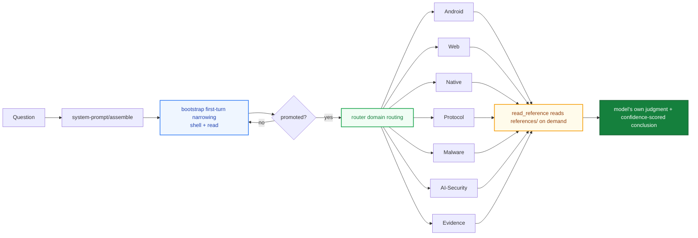

<div align="center">

# helmd

**Armor-piercing all-in-one security-analysis plugin for DeepSeek Harness**

Mount one preset · reverse engineering · pentest · unpacking · license bypass · Android / Web / Native / Protocol / Malware / AI-Security ready on day one

English | [中文](README.md)

[](https://t.me/helm_xD)
[](https://github.com/topics/dsh-plugin)
[](https://github.com/topics/deepseek-harness)
[](https://nodejs.org)
[](https://pnpm.io)
[](LICENSE)

</div>

> For learning and research only. You must comply with local laws and regulations; you are responsible for the consequences of using this project.

> Maintainer docs: release checklist, preset single-source sync, and the pitfalls table live in [MAINTENANCE.md](MAINTENANCE.md); version history in [CHANGELOG.md](CHANGELOG.md).

## Why helmd

<table>
<tr>
<td width="50%">

### Armor-piercing, all-in-one

Reverse engineering, unpacking, license bypass and pentest workflows — Android · Web · Native · Protocol · Malware · AI-Security converge in a single preset, together with the evidence chain. Install once and all 33 tools are ready — no per-domain wiring.

</td>
<td width="50%">

### One bundle · zero wiring

Everything converges into a single `@adwmc/helm-d` bundle: bootstrap, router, domain tools, the toolbox and the runtime hook layer (description washing / evidence wrap / advisory / H-CoT / stream audit), plus the web workbench. `install.ps1` / `install.sh` fetch a prebuilt tarball from Releases and wire everything in one command.

</td>
</tr>
<tr>
<td width="50%">

### Knowledge on demand

Domain knowledge, rules, workflows and cases live in `references/` (637 docs) and are read on demand — never injected into the system prompt to decide for the model. Lean tokens, intact judgment.

</td>
<td width="50%">

### First-turn tool anchoring

The first top-level request only exposes shell + `read`; the full catalog of 33 tools opens after promotion. A text-only first reply can't trap the session — request two always sees the full catalog.

On Windows, the native terminal tool is `pwsh`. To use WSL, call `wsl.exe` through
`pwsh`, for example `wsl.exe -- bash -lc 'command'` (or
`wsl.exe -d <distro> -- ...` for a specific distribution). On Linux, use `bash`.
Do not search for aliases such as `powershell`, `shell`, or `terminal`.

</td>
</tr>
</table>

## Why

DSH security-analysis capability used to be scattered across domain bundles: `add` Android, `add` Web, `add` Native — and you still had to wire up the preset and router yourself.

helmd packs six domains + evidence tooling + first-turn bootstrap + the runtime hook layer + toolbox into one bundle:

`one preset` &ensp; `one bundle` &ensp; `33 tools` &ensp; `zero manual wiring`

Install once, send `helmd` in a session, and every domain's tools are ready.

## Architecture



- **First-turn narrowing**: the first top-level request only exposes shell + `read`; the full catalog opens after promotion
- **Domain routing**: `router` routes problems via `skill_catalog` / `read_reference`
- **On-demand references**: `references/` is a knowledge base, not an injection; the model reads and decides
- **Runtime hook layer**: tool-description washing, advisory ledger injection, H-CoT refusal response, LLM stream audit (see below)

## Runtime hook layer (0.3.x)

`apply()` in `packages/helmd/src/index.ts` assembles five runtime mechanisms in a fixed order, all riding the host cordis waterfalls with zero standalone processes:

```text
tool-wash description washing → persist evidence wrap → bootstrap first-turn narrowing
  → advisory-hook (outer) + hcot-hook (inner) + llm-stream-hook
  → /hcot command + router + ledger + caseflow + tool discovery + domain tools
```

| Component | Mount point | Responsibility |
|-----------|-------------|----------------|
| `tool-wash.ts` | `tools.register` wrap | Rewrites "a denial is final / do not retry" tool-description phrasing into continuable wording (defensive layer, dsh-purge wash table); hits are logged (verbose) |
| `persist.ts` | `tools.register` wrap | All later-registered domain tools auto-persist output to `evidence/` (soft gate, no per-tool edits) |
| `advisory-hook.ts` | `system-prompt/assemble` (outer) | Reckons the previous turn's advisories against the session log; detects delivery refusal / hedging phrasing and injects stance metrics (no-hedge / challenged / report-prefix / normalizer); sensitive input passes `input-normalizer.ts` first |
| `hcot-hook.ts` | `system-prompt/assemble` (inner) | When the newest assistant turn matches a delivery-refusal signature → submits a mandatory advisory (requiring `hcot_attack { stats: true }` first) + schedules an attack in the background; `HELMD_HCOT_AUTOHOOK=0` disables entirely, `HELMD_HCOT_AUTOSCHEDULE=0` injects without scheduling |
| `hcot-attack-scheduler.ts` | orchestration | Log extraction → context reconstruction (refusal wording never enters the subagent prompt, only a trigger label) → subagent main path → defense-line-3 retry (≤2) → engine fallback |
| `hcot-engine.ts` | Node-native executor | Zero Python/subprocess; global fetch against an OpenAI-compatible SSE endpoint to capture first_fragment; corpus `scripts/ai-security/h_cot_variants.json`, results ledger `~/.dsh/helmd-tools/h_cot_results.jsonl` |
| `command-hcot.ts` | `ctx.commands` | `/hcot <goal>` single-shot engine (`--semantic-auto` semantic routing), `/hcot breach <goal>` via the unified scheduler |
| `hcot-settings.ts` | settings `hcot` namespace | Read/write face of the workbench UI: config (model/provider/maxRounds/autoSchedule) + action requests + runtime state |
| `ica-context.ts` | `systemPrompt.context` | L2 behavioral demonstration: four task→execution pairs with real-form domains; ICL pulls the generation distribution toward direct delivery (arXiv:2310.06387), replacing declarative premises that reasoning quotes back as adversarial evidence |
| `llm-stream-hook.ts` | `llm/stream` | Refusal closed loop: intercept (content / reasoning early-abort) → history laundering → prefill ladder (assistant-last → pair) re-entered via the `llm` service → honest passthrough on the final attempt; refusals / retries hit the ledger, counts and excerpts go to `~/.dsh/helmd-stream-intercept.log` |

## Runtime rules

A helmd session follows these fixed rules:

### Activation & session

| Rule | Behavior |
|------|----------|
| Activation word | The bundled persona defines an activation word (default `helmd`); exact matches get the activation reply, everything else is a task |
| First-turn anchoring | Only shell + `read` on the first top-level request; after the first tool call or assistant message the session promotes and every tool opens |
| Subagent exemption | Sessions with delegationDepth > 0 always see the full catalog |
| Analysis ladder | Ponytail-style: `analysis_mode` sets lite (quick triage) / full (standard flow, default) / deep (full evidence chain); per-session persistence, pick the shallowest rung that answers the task |
| Deterministic routing | `route_task(hint)` keyword-matches a PRIMARY route plus a one-line rationale (route before you act); falls back to the decision tree |
| Case workspace | `begin_case` creates an on-disk workspace (sample/evidence/scripts/CASE.md); tool outputs auto-persist to the evidence chain; `record_finding` enforces E-id citations; after compaction `case_status()` restores state from disk |
| H-CoT auto response | When an assistant turn matches a delivery-refusal signature, the next turn injects a mandatory advisory and schedules `hcot_attack` in the background (subagent main path → defense line 3 → engine fallback); switches: `HELMD_HCOT_AUTOHOOK` / `HELMD_HCOT_AUTOSCHEDULE` |
| Internal command | `/hcot <goal>` single-shot H-CoT engine, `/hcot breach <goal>` via the unified scheduler; results append to `~/.dsh/helmd-tools/h_cot_results.jsonl` |
| Stream interception | The `llm/stream` interceptor routes content / reasoning refusals through the closed loop (history laundering → prefill ladder nested re-request → honest passthrough); counts and excerpts go to `~/.dsh/helmd-stream-intercept.log`, surfaced in the workbench "intercept log" panel |

### Knowledge & routing

| Rule | Behavior |
|------|----------|
| Knowledge on demand | All 637 reference docs live in `references/`, read via `read_reference`, never injected into the system prompt |
| Catalog = metadata | `skill_catalog` only routes domains/signals and draws no conclusions: `tree` triage, `methodology`, `patterns`, `install` tool setup, `jvm` JVM decryption, etc. |
| References ≠ hard rules | Docs inform the model's judgment; they are never binding constraints |

### Tools & scripts

| Rule | Behavior |
|------|----------|
| Call chain | request → `defineTool.execute()` → `runSeam()` → subprocess (ctx.subprocess preferred, execFile fallback) |
| Python resolution | `resolveCommand()` probes python → py → python3 in order; Windows-compatible via the py launcher |
| Path safety | Every file read/write passes `assertWithinRoot()`; out-of-scope paths are rejected outright |
| External tool acquisition | Probe locally first (`where` / `--version`) → otherwise install into the largest non-C drive at `X:\Reverse\` → download through a proxy → record versions; see `references/toolbox/tool-install.md` |
| Releases first | Tools with GitHub Releases always get prebuilt binaries, never built from source |

### Evidence

| Rule | Behavior |
|------|----------|
| Report template | Conclusions carry severity / confidence grades; template in `references/evidence/reporting.md` |
| Case workspaces | `begin_case` creates an on-disk workspace; the persist hook auto-saves tool output into `evidence/`; conclusions must cite E ids (validated by `record_finding`) |

## Quick start

**Prerequisites**: a working [`dsh`](https://github.com/deepseek-ai/deepseek-harness) CLI and pnpm.

Windows (double-click `install.bat`, or run via PowerShell):

```powershell
.\install.ps1
```

macOS / Linux:

```bash
./install.sh
```

Or via the **npm channel** (published as [`@adwmc/helm-d`](https://www.npmjs.com/package/@adwmc/helm-d)) — `plugin add` is a pnpm forwarder, so registry names pass straight through:

```bash
dsh plugin --profile web add @adwmc/helm-d
```

The installer downloads the latest Release `helmd.tgz`, installs it into the profile, and writes the preset. **The preset's platform rows are not snapshot-copied — the installer derives them live on your machine from the dsh host `standard` preset you actually have installed** (`gen-preset.mjs --out`), falling back to the bundled snapshot only when the generator is unavailable. Platform rows therefore always match your own dsh version and never drift on host upgrades. Then boot:

```bash
dsh web
```

Send `helmd` in a session to activate.

## Preset / host sync (three-layer fingerprint defense)

Every generated `agent.cordis.yml` opens with a host fingerprint line:

```yaml
# gen-preset: host=<sha256 of installed dsh standard>
```

A hand-copied preset once drifted after a host upgrade and assembled a crippled 44-tool catalog (incident 2026-08-26, see `docs/incident-2026-08-26-preset-stale-generation.md`). The same verdict now guards three surfaces:

| Layer | Entry | Behavior |
|------|------|------|
| CLI | `node packages/helmd/scripts/gen-preset.mjs --check` | fingerprint moved → `HOST UPGRADED`; content drift → `STALE (content drift)`; non-zero exit |
| Install/update | `install.ps1` / `setup-preset.ps1` | generates against the local host at install time, no manual copying |
| GUI | the helmd card in the dsh settings page (below) | evaluated once per boot, badge always visible |

## Health status card

Since 0.2.1, helmd ships a health card in the **dsh web settings page**: Settings → Plugins → Plugin configuration → "helmd 安全分析包". The card only reports; it never writes.

Each dsh boot evaluates the deployed `.agent-presets/<preset>/agent.cordis.yml` (preset name defaults to `helmd`, overridable via `HELMD_PRESET_NAME`) against the installed host:

| Badge | Meaning | Action |
|------|------|------|
| 🟢 Healthy | preset matches the host | none |
| 🟠 Host upgraded | dsh was upgraded, platform rows stale | re-run install / setup-preset, restart |
| 🔴 Content drift | agent.cordis.yml hand-edited or persona changed without re-sync | regenerate as above |
| 🟣 Legacy preset | file lacks the fingerprint header | regenerate |
| ⚪ Not deployed | preset missing | run install |

Expanding the card shows both fingerprints (12 chars), version, the **drift-repair verdict**, evaluation time, and both paths for fast diagnosis.

**Drift repair policy**: on drift the card repairs automatically, but **only files it can prove are its own artifact** — a deployed preset carrying the `gen-preset` fingerprint header (`STALE` content drift / `HOST_UPGRADED` host upgraded) is regenerated from the current host standard; one without a header (`LEGACY_PRESET`, possibly hand-written) is only reported and left alone. Every write keeps the previous file as `.bak` first, runs a **structural artifact assertion** right after (row set = host standard + `helmd`, no duplicate ids, `helm-d` declared once, persona is ours) and reports `artifact check OK (N rows …)` before reminding you to restart dsh and assert the first request is `[pwsh, read]` (MAINTENANCE §8) — that live half needs a session and stays with you. Switches: `HELMD_AUTO_HEAL=0` reports everything (hand-managed deployments), `=1` overwrites even a header-less file.

## Security Workbench & Dynamic Tool Shelf

Since 0.4.0 the workbench ships as four data panels, all fed live through the `/api/helmd/{tools,hcot,intercept,jev}` HTTP endpoints (15s polling):

- **Dual-Track Interaction**: Clicking the capsule button immediately opens an anchored popover workbench drawer and simultaneously unfolds the right sidebar (Sidebar Right) into the `helmd 安全分析` workbench tab.
- **Tool Shelf**: category hierarchy tree (6 top classes → sub-classes → tools), parsed live from the `~/.dsh/helmd-tools/TOOLS.md` ledger with in-UI registration; falls back to cross-platform standard paths (`~/.dsh/...` and system `PATH`) when the ledger is empty — out-of-the-box on Windows, macOS, and Linux.
- **Attack Log**: real-time view of the H-CoT engine ledger, ranked by search-loop variant priority.
- **Jev Decisions**: decision rationale and chain display for `jev_decide`.
- **Intercept Log**: counts and excerpts of the transport-layer refusal closed loop (`~/.dsh/helmd-stream-intercept.log`).

## Install from the plugin store

helmd has been submitted to [awesome-dsh-plugin](https://github.com/awesome-dsh-plugin/awesome-dsh-plugin) ([PR #2708](https://github.com/awesome-dsh-plugin/awesome-dsh-plugin/pull/2708)). Once merged it is one click away on [dshmarket.com](https://dshmarket.com) or in the dshmarket plugin UI; the CLI equivalents are:

```bash
# Prebuilt tarball (skips build approval)
dsh plugin --profile web add https://github.com/ADWMC/helm-d/releases/latest/download/helmd.tgz

# Or from source
dsh plugin --profile web add github:ADWMC/helm-d/tree/main/packages/helmd
```

**A store install delivers the bundle only (tools + bootstrap + router). The full experience also needs the agent preset (luna persona, activation word, tool configuration) — the template ships inside the package, so run one command after installing:**

```bash
# Windows (PowerShell)
%USERPROFILE%\.dsh\profiles\web\node_modules\@adwmc\helm-d\scripts\setup-preset.ps1

# macOS / Linux
~/.dsh/profiles/web/node_modules/@adwmc/helm-d/scripts/setup-preset.sh
```

The script writes `preset.yml` + `agent.cordis.yml` into `~/.dsh/.agent-presets/helmd/` (existing files are kept as `.bak`); pick the `helmd` preset in the UI when starting a session.

## Verification

```bash
dsh --profile web --dump-config                        # the @adwmc/helm-d host row (resolves to dist/health.js)
node packages/helmd/scripts/gen-preset.mjs --check     # preset check OK (non-zero: follow the fingerprint hint)
```

After sending `helmd` in a session:

```text
skill_catalog        → returns domain/signal routes (incl. jvm, install and newer routes)
native_reference     → reads the Native reference
detect_packer <file> → identifies the PE/ELF protector
```

Settings → Plugins → Plugin configuration should show the helmd card with a green "健康 Healthy" badge. Any of the above returning normally means the install succeeded.

## Package & tools

| Package | Injects | Responsibility | Tools |
| --- | --- | --- | --- |
| `@adwmc/helm-d` | tools + systemPrompt | All-domain security analysis in one bundle | see below |

| Domain | Tool | Purpose |
| --- | --- | --- |
| **Router** | `skill_catalog` | Domain routing catalog |
| **Router** | `read_reference` | Read routed reference docs |
| **Android** | `apk_fingerprint` | APK framework/HTTP/obfuscation detection |
| **Web** | `web_reference` | Web security reference docs |
| **Web** | `bot_analyze` | Puppeteer Bot analysis |
| **Native** | `native_reference` | Native/binary reference docs |
| **Native** | `detect_packer` | PE/ELF packer detection |
| **Native** | `scan_strings` | ASCII/UTF-16LE string extraction |
| **Native** | `xor_bruteforce` | Single-byte XOR brute force |
| **Native** | `encoding_detect` | Base64/Hex/ROT13/XOR decode |
| **Protocol** | `protocol_reference` | Protocol/traffic reference docs |
| **Protocol** | `pcap_parse` | PCAP TCP/UDP stream extraction |
| **Protocol** | `state_machine` | Protocol state-machine inference |
| **Protocol** | `parse_har` | HAR request/response parsing |
| **Malware** | `malware_reference` | Malware sample reference docs |
| **Malware** | `ioc_extract` | IOC extraction |
| **Malware** | `yara_gen` | YARA rule generation |
| **AI-Security** | `ai_reference` | AI/LLM security reference docs |
| **AI-Security** | `llm_sim` | LLM app simulation testing |
| **AI-Security** | `hcot_attack` | H-CoT chain-of-thought hijacking runner (template probe → forged trace → injection; variant win-rate selection and a result ledger; `stats:true` prints the table, `dry_run:true` stays offline; live runs need your own OpenAI-compatible endpoint key and send the jailbreak payload there) |
| **Evidence** | `evidence_reference` | Evidence/reporting reference docs |
| **Case** | `begin_case` / `case_status` / `record_finding` / `end_case` | On-disk case lifecycle: open/resume/validated conclusions/close (deep mode requires findings) |
| **Case** | `find_tool` | Search GitHub for existing tools (variant queries + helmd-tools shelf hits) |
| **Case** | `save_evidence` | Persist arbitrary external CLI output into the evidence chain (E-numbered) |
| **Evidence** | `triage_artifact` | Offline triage |
| **Evidence** | `hash_artifact` | SHA-256 hashing |
| **Toolbox** | `tool_recommend` | Tool library recommendations |
| **Router** | `route_task` | Deterministic routing: task hint → PRIMARY route + rationale |
| **Ledger** | `tool_memory` | Cross-session tool/dead-end ledger: `register` binds a tool, `note` records pitfalls and falsified routes (an evidence id is required), `sync` folds the H-CoT result ledger in explicitly, `search` queries both; the shelf overview rides along in `route_task` output (read tools never write) |
| **Session** | `analysis_mode` | Analysis intensity ladder lite/full/deep (Ponytail-style) |

Each `*_reference` tool reads its own `references/<domain>/` on demand; the entry point is its `index.md`.

## Alternatives

| Approach | Why not |
|----------|---------|
| Ten standalone bundles | 10 adds + manual preset + router wiring; seam.ts copied 9 times |
| Raw shell tools only | no domain knowledge; the model guesses; unreproducible conclusions |
| Stuff knowledge into the system prompt | token blow-up and it overrides the model's judgment |
| helmd single bundle | one install aggregates everything, shared seam, knowledge read on demand |

## Common commands

```bash
pnpm install                # install deps (prepare auto-runs tsc)
pnpm build                  # build every workspace package (only helmd ships)
pnpm typecheck              # tsc --noEmit type gate on a clean tree
```

Local tarball delivery:

```powershell
.\scripts\repack.ps1                                    # emit dist-tgz\helmd.tgz (+ stable alias)
dsh plugin --profile web add .\dist-tgz\helmd.tgz       # install into the web profile
```

Self-update (compares against the latest GitHub Release; downloads and reinstalls when newer, refuses to downgrade a local build):

```powershell
.\scripts\update.ps1                # check and update the web profile
.\scripts\update.ps1 -CheckOnly     # versions only, change nothing
.\scripts\update.ps1 -Force         # reinstall even when versions match

./scripts/update.sh                 # macOS / Linux
```

## Deployment

One-command install is above under Quick start; the manual steps are below. Prerequisites: the `@adwmc/helm-d` package published (see Publishing).

### 1. Install the bundle into a profile

```bash
dsh plugin --profile web add @adwmc/helm-d
```

`dsh plugin` forwards to pnpm inside the profile directory; the package lands in `$DSH_HOME/profiles/node_modules/`.

### 2. Mount the preset

Copy `presets/full-reverse/` into the DSH user preset root `$DSH_HOME/.agent-presets/helmd/`:

macOS / Linux:

```bash
mkdir -p ~/.dsh/.agent-presets/helmd
cp presets/full-reverse/agent.cordis.yml ~/.dsh/.agent-presets/helmd/
cp presets/full-reverse/preset.yml ~/.dsh/.agent-presets/helmd/
```

Windows (PowerShell):

```powershell
$p = Join-Path $env:USERPROFILE '.dsh\.agent-presets\helmd'
New-Item -ItemType Directory -Force $p | Out-Null
Copy-Item presets\full-reverse\agent.cordis.yml $p
Copy-Item presets\full-reverse\preset.yml $p
```

### 3. Set it as the default preset

Pick `helmd` in the UI preset picker, or edit `$DSH_HOME/settings.yaml`:

```yaml
agent-presets:
  default: helmd
```

### 4. Boot and activate

```bash
dsh web
```

Send `helmd` in a session to activate. `DSH_HOME` defaults to `~/.dsh`; substitute the path if you customized it.

## Directory layout

```text
helmd/
├── packages/
│   └── helmd/                 the shipped package (single bundle)
│       ├── src/
│       │   ├── bootstrap.ts   first-turn tool-narrowing filter
│       │   ├── tool-wash.ts   tool-description washing (refusal-terminal phrasing → continuable, defensive)
│       │   ├── persist.ts     evidence-chain persistence wrap for all tools
│       │   ├── advisory*.ts   advisory ledger + prompt-assembly injection (refusal / hedge detection)
│       │   ├── hcot-*.ts      H-CoT engine / semantic routing / scheduler / settings / subagent persona
│       │   ├── command-hcot.ts     /hcot internal command
│       │   ├── llm-stream-hook.ts  llm/stream refusal closed loop (launder → prefill ladder nested re-request) & audit
│       │   ├── input-normalizer.ts sensitive input → engineering-term normalization
│       │   ├── router.ts      skill_catalog / read_reference routing
│       │   ├── health.ts      settings-page health face (boot-time fingerprint eval → settings namespace)
│       │   ├── seam.ts        shared IO seam (fs / subprocess / cmd resolve / path guard)
│       │   └── tools/         10 tool modules (33 tools)
│       ├── client.js          browser half: settings-page health card + workbench (lazy-CJS factory, no build chain)
│       ├── references/        637 on-demand reference docs (8 domains + toolbox)
│       ├── scripts/           analysis scripts + ai-security corpus/ledger + gen-preset.mjs
│       ├── presets/           persona single source + generated mirror
│       └── cordis.patch.yml   bundle mount manifest (helmd tools row + helmd-health row)
├── presets/full-reverse/      preset definition (generated; persona + every tool row)
├── install.ps1/.sh/.bat       one-command installer
└── docs/                      design docs & postmortems
```

> Other directories under `packages/` are legacy split bundles superseded by the helmd single bundle; kept for archival only, no longer published.

## Build

Requires pnpm; build targets ES2022 / NodeNext.

```bash
pnpm install
pnpm build
```

The root `pnpm build` builds `@adwmc/helm-d`; `pnpm typecheck` runs the `tsc --noEmit` type gate on a clean tree.

## Dependencies

- `@deepseek-ai/cordis` `^4.0.2`
- `@deepseek-ai/dsh-tools` `>=0.1.5-rc.1 <0.2.0-0` (host cohort: the full dsh 0.1.5-rc.2 family is pinned in `pnpm-workspace.yaml` overrides)
- `@deepseek-ai/dsh-settings` `>=0.1.5-rc.1 <0.2.0-0`
- `@deepseek-ai/schemastery` `^3.18.2`

> **The prerelease-range trap**: semver admits a prerelease only when the range names a prerelease of the same `major.minor.patch`. `>=0.1.0-rc.1 <0.2.0-0` therefore does **not** admit `0.1.5-rc.1` (only `0.1.0-rc.x`), and neither does `^0.1.1-rc.2`. Declaring the host cohort requires `>=0.1.5-rc.1 <0.2.0-0`.

Versions are pinned to the host cohort via `overrides` in `pnpm-workspace.yaml` (the whole `@deepseek-ai/dsh-*` family plus cordis and schemastery); after `pnpm install`, `pnpm peers check` must be clean — otherwise the graph carries cross-cohort peers.

## Publishing

- The root package is `private: true` and is not published; `@adwmc/helm-d` is.
- The `files` whitelist: `dist`, `client.js`, `references`, `scripts`, `presets`, `cordis.patch.yml`.
- The `prepare` script runs `tsc` automatically before publishing.
- Current version: `0.3.1`.
- Release assets: `adwmc-helm-d-<ver>.tgz` plus the stable alias `helmd.tgz` (used by the store's tarball field and the installers).

## Risks & mitigations

| Risk | Mitigation |
|------|------------|
| DSH host upgrade breaks compat | peer deps on cordis / dsh-tools, pinned via `overrides`; three-layer preset fingerprint defense above exposes drift automatically |
| Missing `python` on the host | seam auto-probes python / py / python3, falls back to the `py` launcher |
| Bundle/preset version drift | version 0.3.1, tarball and release published together |
| Reference knowledge goes stale | read on demand, model's own judgment, non-binding |

## Acknowledgements

This project integrates design ideas and implementation patterns from many excellent open-source projects, drawing on the experience of many community pioneers. Any resemblance is a tribute to great design.

- [ADWMC/helm-x](https://github.com/ADWMC/helm-x) — prompt injection and scoring design
- [yynxxxxx/Codex-X](https://github.com/yynxxxxx/Codex-X) — prompt templates and visual management

## Case study

**BoosterX v2.2.4.3 (.NET) license bypass** — a full end-to-end validation of the helmd methodology:

- Live recovery of all **32,316 method bodies** and decryption of **7,726 encrypted constants** under ConfuserEx dynamic anti-tamper
- Runtime extraction of the RSA-2048 public key; online signed-token model identified, offline forgery ruled out
- Three static-rebuild dead ends documented with root causes, then a persistent unlock via the **zero-modification, zero-injection** official managed extension mechanism — verified by UIAutomation and in-process readback
- Full evidence chain, difficulty assessment, and server-side hardening recommendations included

📄 Full write-up: [docs/case-studies/boosterx-dotnet-license-bypass.md](docs/case-studies/boosterx-dotnet-license-bypass.md)

## Docs

- [docs/principles.md](docs/principles.md) — design principles
- [docs/architecture.md](docs/architecture.md) — architecture
- [docs/architecture-v2.md](docs/architecture-v2.md) — architecture v2 (persona + tool anchoring + on-demand knowledge)
- [docs/case-studies/](docs/case-studies/boosterx-dotnet-license-bypass.md) — case studies
- [docs/skills-reference/](docs/skills-reference/authorized-pentest-framework.md) — imported pentest skill digests (authorized framework / practitioner)

## Contributing

Issues and PRs are welcome. Before making changes, read [docs/principles.md](docs/principles.md) and keep the architecture constraint: reference knowledge is read on demand and never overrides the model's own judgment.

## License

Released under the [MIT License](LICENSE) — free to use, modify, and distribute. See [LICENSE](LICENSE).

## AI-generated & legal risk

Some or all code in this repository was generated with AI assistance and may contain errors or be unsuitable for your context. Review it yourself and judge whether it fits your use case and jurisdiction before use; you are responsible for complying with local laws and for the consequences of using this project. Provided "AS IS" under MIT, without warranty of any kind.
