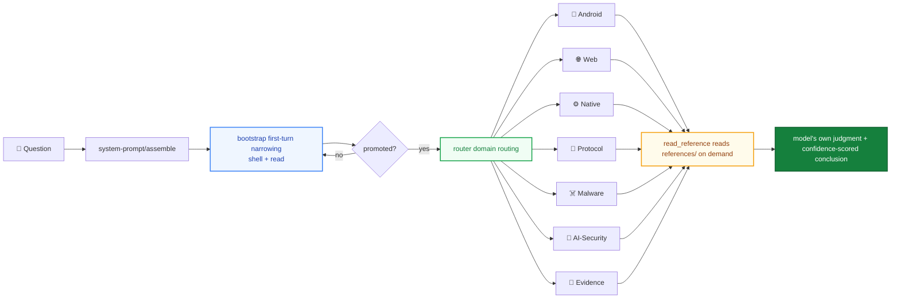

<div align="center">

# helmd

**Armor-piercing all-in-one security-analysis plugin for DeepSeek Harness**

Mount one preset · Android · Web · Native · Protocol · Malware · AI-Security ready on day one

English | [中文](README.md)

[](https://t.me/helm_xD)
[](https://github.com/topics/dsh-plugin)
[](https://github.com/topics/deepseek-harness)
[](https://nodejs.org)
[](https://pnpm.io)
[](LICENSE)

</div>

> For learning and research only. You must comply with local laws and regulations; you are responsible for the consequences of using this project.

## Why helmd

<table>
<tr>
<td width="50%">

### 🛡️ Armor-piercing, all-in-one

Android · Web · Native · Protocol · Malware · AI-Security converge in a single preset. Install once and every domain's tools are ready — no per-domain wiring.

</td>
<td width="50%">

### 🧩 Nine bundles · zero wiring

9 `@dsh-security/*` bundles, independently publishable and loaded on demand. `install.ps1` / `install.sh` install everything and mount the preset and router automatically.

</td>
</tr>
<tr>
<td width="50%">

### 📚 Knowledge on demand

Domain knowledge, rules, workflows and cases live in `references/` and are read on demand — never injected into the system prompt to decide for the model. Lean tokens, intact judgment.

</td>
<td width="50%">

### ⚓ First-turn tool anchoring

The first top-level request only exposes shell + `read`; the full catalog opens after promotion. A text-only first reply can't trap the session — request two always sees the full catalog.

</td>
</tr>
</table>

## Why

DSH security-analysis capability is scattered across domain bundles: `add` Android, `add` Web, `add` Native — and you still have to wire up the preset and router yourself.

helmd packs six domains + evidence tooling + first-turn bootstrap into one preset:

`one preset` &ensp; `nine bundles` &ensp; `zero manual wiring`

Install once, send `helmd` in a session, and every domain's tools are ready.

## Architecture



- **First-turn narrowing**: the first top-level request only exposes shell + `read`; the full catalog opens after promotion
- **Domain routing**: `router` routes problems via `skill_catalog` / `read_reference`
- **On-demand references**: `references/` is a knowledge base, not an injection; the model reads and decides

## Quick start

**Prerequisites**: a working [`dsh`](https://github.com/deepseek-ai/deepseek-harness) CLI and pnpm.

Windows (double-click `install.bat`, or run via PowerShell):

```powershell
.\install.ps1
```

macOS / Linux:

```bash
./install.sh
```

The installer adds the 9 bundles, mounts the `helmd` preset, and sets the default in one shot. Then boot:

```bash
dsh web
```

Send `helmd` in a session to activate.

## Verification

```bash
dsh --profile web --dump-config   # you should see the 9 @dsh-security bundle rows
```

After sending `helmd` in a session:

```text
skill_catalog        → returns the six-domain route map
native_reference     → reads the Native reference
detect_packer <file> → identifies the PE/ELF protector
```

Any of the above returning normally means the install succeeded.

## Packages

| Package | Injects | Responsibility | Tools |
| --- | --- | --- | --- |
| `@dsh-security/bootstrap` | systemPrompt | First-turn tool-catalog narrowing, full catalog after promotion | none |
| `@dsh-security/router` | tools | Domain routing and catalog | `skill_catalog`, `read_reference` |
| `@dsh-security/skill-android` | tools | Android reversing | `apk_fingerprint` |
| `@dsh-security/skill-web` | tools | Web security | `web_reference`, `bot_analyze` |
| `@dsh-security/skill-native` | tools | Native / binary reversing | `native_reference`, `detect_packer`, `scan_strings`, `xor_bruteforce`, `encoding_detect` |
| `@dsh-security/skill-protocol` | tools | Protocol / traffic | `protocol_reference`, `pcap_parse`, `state_machine`, `parse_har` |
| `@dsh-security/skill-malware` | tools | Malware samples | `malware_reference`, `ioc_extract`, `yara_gen` |
| `@dsh-security/skill-ai-security` | tools | AI / LLM security | `ai_reference`, `llm_sim` |
| `@dsh-security/skill-evidence` | tools | Evidence / reporting / case | `evidence_reference`, `create_case`, `triage_artifact`, `hash_artifact` |

Each `*_reference` tool reads its own `references/` on demand; the entry point is its `index.md`.

## Alternatives

| Approach | Why not |
|----------|---------|
| Install domain bundles by hand | 9 adds + manual preset + router wiring; repetitive and error-prone |
| Raw shell tools only | no domain knowledge; the model guesses; unreproducible conclusions |
| Stuff knowledge into the system prompt | token blow-up and it overrides the model's judgment |
| helmd | one preset aggregates everything; knowledge read on demand |

## Common commands

```bash
pnpm install                # install deps (prepare auto-runs tsc)
pnpm build                  # build all 9 bundles
pnpm typecheck              # tsc --noEmit type gate on a clean tree
```

Local tarball delivery:

```powershell
.\scripts\repack.ps1                            # emit dist-tgz\*.tgz
dsh plugin --profile web add .\dist-tgz\*.tgz   # install into the web profile
```

## Deployment

One-command install is above under Quick start; the manual steps are below. Prerequisites: the 9 `@dsh-security/*` packages published to npm (see Publishing).

### 1. Install the bundles into a profile

```bash
dsh plugin --profile web add \
  @dsh-security/bootstrap \
  @dsh-security/router \
  @dsh-security/skill-android \
  @dsh-security/skill-web \
  @dsh-security/skill-native \
  @dsh-security/skill-protocol \
  @dsh-security/skill-malware \
  @dsh-security/skill-ai-security \
  @dsh-security/skill-evidence
```

`dsh plugin` forwards to pnpm inside the profile directory; the packages land in `$DSH_HOME/profiles/node_modules/`.

### 2. Mount the preset

Copy `presets/full-reverse/` into the DSH user preset root `$DSH_HOME/.agent-presets/helmd/`:

macOS / Linux:

```bash
mkdir -p ~/.dsh/.agent-presets/helmd
cp presets/full-reverse/agent.cordis.yml ~/.dsh/.agent-presets/helmd/
cp presets/full-reverse/preset.yml ~/.dsh/.agent-presets/helmd/
```

Windows (PowerShell):

```powershell
$p = Join-Path $env:USERPROFILE '.dsh\.agent-presets\helmd'
New-Item -ItemType Directory -Force $p | Out-Null
Copy-Item presets\full-reverse\agent.cordis.yml $p
Copy-Item presets\full-reverse\preset.yml $p
```

### 3. Set it as the default preset

Pick `helmd` in the UI preset picker, or edit `$DSH_HOME/settings.yaml`:

```yaml
agent-presets:
  default: helmd
```

### 4. Boot and activate

```bash
dsh web
```

Send `helmd` in a session to activate. `DSH_HOME` defaults to `~/.dsh`; substitute the path if you customized it.

## Directory layout

```text
helmd/
├── packages/
│   ├── bootstrap/            first-turn tool-narrowing filter
│   ├── router/               domain routing and catalog
│   ├── skill-ai-security/    AI / LLM security
│   ├── skill-android/        Android reversing
│   ├── skill-web/            Web security
│   ├── skill-native/         Native / binary reversing
│   ├── skill-protocol/       Protocol / traffic
│   ├── skill-malware/        Malware samples
│   └── skill-evidence/       Evidence / reporting / case
├── presets/
│   └── full-reverse/
└── docs/
```

## Build

Requires pnpm; build targets ES2022 / NodeNext.

```bash
pnpm install
pnpm -r build
```

The root `pnpm build` is equivalent to `pnpm -r build`, running `tsc` per package; `pnpm typecheck` runs the `tsc --noEmit` type gate on a clean tree.

## Dependencies

- `@deepseek-ai/cordis` `4.0.1`
- `@deepseek-ai/dsh-tools` `0.1.0-rc.6`

Versions are pinned via `overrides` in `pnpm-workspace.yaml`.

## Publishing

- The root package is `private: true` and is not published; the 9 `@dsh-security/*` sub-packages are.
- Each sub-package's `files` whitelist is limited to `dist`, `references`, `scripts`, `cordis.patch.yml`.
- Each sub-package's `prepare` script runs `tsc` automatically before publishing.
- Current version: `0.1.1`.

## Risks & mitigations

| Risk | Mitigation |
|------|------------|
| DSH host upgrade breaks compat | peer deps on cordis / dsh-tools, pinned via `overrides` |
| Missing `python` on the host | seam auto-probes python / py / python3, falls back to the `py` launcher |
| Bundle/preset version drift | version 0.1.1, tarball and release published together |
| Reference knowledge goes stale | read on demand, model's own judgment, non-binding |

## Acknowledgements

This project integrates design ideas and implementation patterns from many excellent open-source projects, drawing on the experience of many community pioneers. Any resemblance is a tribute to great design.

- [ADWMC/helm-x](https://github.com/ADWMC/helm-x) — prompt injection and scoring design
- [yynxxxxx/Codex-X](https://github.com/yynxxxxx/Codex-X) — prompt templates and visual management

## Docs

- [docs/principles.md](docs/principles.md) — design principles
- [docs/architecture.md](docs/architecture.md) — architecture
- [docs/architecture-v2.md](docs/architecture-v2.md) — architecture v2 (persona + tool anchoring + on-demand knowledge)

## Contributing

Issues and PRs are welcome. Before making changes, read [docs/principles.md](docs/principles.md) and keep the architecture constraint: reference knowledge is read on demand and never overrides the model's own judgment.

## License

Released under the [MIT License](LICENSE) — free to use, modify, and distribute. See [LICENSE](LICENSE).

## AI-generated & legal risk

Some or all code in this repository was generated with AI assistance and may contain errors or be unsuitable for your context. Review it yourself and judge whether it fits your use case and jurisdiction before use; you are responsible for complying with local laws and for the consequences of using this project. Provided "AS IS" under MIT, without warranty of any kind.
