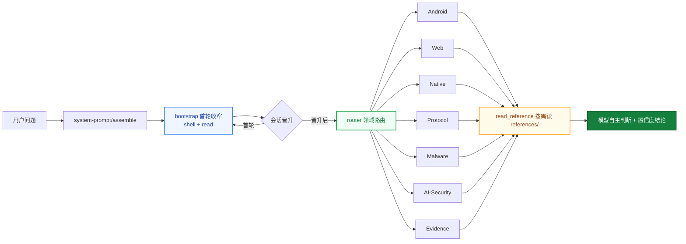

<div align="center">

# helmd

**DeepSeek Harness 破甲一体化安全分析插件**

一个 preset 挂载 · Android · Web · Native · Protocol · Malware · AI-Security 六大领域即开即用

[English](README.en.md) | 中文

[](https://t.me/helm_xD)
[](https://github.com/topics/dsh-plugin)
[](https://github.com/topics/deepseek-harness)
[](https://nodejs.org)
[](https://pnpm.io)
[](LICENSE)

</div>

> 仅供学习交流。使用者须遵守所在地法律法规，对使用本项目产生的后果自负。

> 维护者文档：发布流程、preset 单源同步、坑位表见 [MAINTENANCE.md](MAINTENANCE.md)。

## Why helmd

<table>
<tr>
<td width="50%">

### 破甲一体化

Android · Web · Native · Protocol · Malware · AI-Security 六大安全领域聚合在一个 preset 里。装一次，全领域工具就绪，不再逐领域拼装。

</td>
<td width="50%">

### 单包聚合 · 一条命令

全部能力收敛进一个 `@dsh-security/helmd` 包。profile 只加载健康检查，preset 在 Agent 隔离上下文中加载 bootstrap、router、七大领域工具和 toolbox。`install.ps1` / `install.sh` 下载 Release 预构建 tarball并自动写入 preset。

</td>
</tr>
<tr>
<td width="50%">

### 知识按需读

领域知识、规则、工作流、案例全部放 `references/`，工具按需读取——不塞进 system prompt 替模型做决定，控 token，也保判断。

</td>
<td width="50%">

### 首轮工具锚定

首个顶层请求只暴露 shell + `read`，晋升后放开完整目录。文本首答不会困在 bootstrap，第二轮一定见到全量工具。

Windows 会话的原生终端工具名是 `pwsh`；需要使用 WSL 时，通过 `pwsh` 执行
`wsl.exe -- bash -lc 'command'`（指定发行版用 `wsl.exe -d <distro> -- ...`）。Linux
会话使用 `bash`。不要搜索 `powershell`、`shell` 或 `terminal` 这些别名。

</td>
</tr>
</table>

## 为什么做这个

DSH 的安全分析能力原本分散在多个领域 bundle：装 Android 要 add，装 Web 要 add，装 Native 还要 add，preset 和 router 也得自己拼。

helmd 把七大领域 + 证据链（evidence）+ 首轮工具锚定（bootstrap）+ 工具箱（toolbox）打包成一个 Agent 专属包：

`一个 preset` &ensp; `一个 bundle` &ensp; `31 个工具` &ensp; `零手动拼装`

装一次，会话里发 `helmd`，全领域工具就绪。

## 架构



- **首轮收窄**：首个顶层请求只暴露 shell + `read`，晋升后放开完整工具目录
- **领域路由**：`router` 用 `skill_catalog` / `read_reference` 把问题路由到对应领域
- **按需参考**：`references/` 是知识库，不是注入物；模型读完后自主判断

## 运行规则

helmd 会话遵循以下固定规则：

### 激活与会话

| 规则 | 行为 |
|------|------|
| 激活词 | preset 内置 persona 定义激活词（默认 `helmd`），精确匹配才回激活语，其余输入一律当任务执行 |
| 首轮锚定 | 首个顶层请求仅暴露 shell + `read`；首次工具调用或助手消息后晋升，放开全部工具 |
| 子代理豁免 | delegationDepth > 0 的会话始终可见完整目录 |
| 分析档位 | Ponytail 式阶梯：`analysis_mode` 设 lite（快速分诊）/ full（标准流程，默认）/ deep（完整证据链），会话内持久，选能回答任务的最浅档 |
| 确定性路由 | `route_task(hint) 关键词匹配出 PRIMARY 路由 + 一句依据（先路由后动手），未命中回落决策树 |
| Case 工作区 | `begin_case` 建立磁盘工作区（sample/evidence/scripts/CASE.md），工具输出自动入证据链；`record_finding` 强制引用 E 编号；上下文压缩后 `case_status()` 从磁盘恢复状态 |

### 知识与路由

| 规则 | 行为 |
|------|------|
| 知识按需读 | 209 个参考文档全放 `references/`，经 `read_reference` 读取，绝不注入 system prompt |
| 目录即元数据 | `skill_catalog` 只做领域/信号路由，不下结论：`tree` 分诊、`methodology` 方法论、`patterns` 模式、`install` 工具安装、`jvm` JVM 解密等 |
| 参考非硬规则 | 文档供模型自主判断，不作为强制约束 |

### 工具与脚本

| 规则 | 行为 |
|------|------|
| 调用链 | 用户请求 → `defineTool.execute()` → `runSeam()` → 子进程（优先 ctx.subprocess，回退 execFile） |
| Python 解析 | `resolveCommand()` 按 python → py → python3 顺序探测，Windows 兼容 py launcher |
| 路径安全 | 所有文件读写经 `assertWithinRoot()` 校验，越界路径直接拒绝 |
| 外部工具获取 | 先查本机（where / --version）→ 无则装到除 C 盘外最大盘的 `X:\Reverse\` → 下载走代理 → 记录版本；详见 `references/toolbox/tool-install.md` |
| Releases 优先 | 有 GitHub Releases 的工具一律下预编译二进制，不源码编译 |

### 存证

| 规则 | 行为 |
|------|------|
| 报告模板 | 结论按 severity / confidence 分级，模板见 `references/evidence/reporting.md` |
| case 工作区 | `begin_case` 建磁盘工作区，工具输出经 persist 钩子自动入 `evidence/`，结论必须引用 E 编号（`record_finding` 校验） |

## 快速上手

**前提**：已安装 [`dsh`](https://github.com/deepseek-ai/deepseek-harness) CLI 与 pnpm。

Windows（双击 `install.bat`，或 PowerShell 运行）：

```powershell
.\install.ps1
```

macOS / Linux：

```bash
./install.sh
```

安装器会下载最新 Release 的 `helmd.tgz`、装入 profile、写入 preset。**preset 平台行不靠快照复制——安装器在本机上直接读取你已装的 dsh 宿主 `standard` 预设实时派生生成**（`gen-preset.mjs --out`），只在生成器不可用时才退回包内快照。这意味着平台工具行永远匹配你自己装的 dsh 版本，不会因宿主升级而漂移。然后启动：

```bash
dsh web
```

会话里发送 `helmd` 即激活。

## Preset 与宿主同步（三层指纹防线）

每个生成的 `agent.cordis.yml` 首行携带宿主指纹：

```yaml
# gen-preset: host=<sha256 of installed dsh standard>
```

8/26 曾发生过手抄平台行在宿主升级后漂移、组装出 44 工具残废目录的事故（见 `docs/incident-2026-08-26-preset-stale-generation.md`），此后的防线是同一套判定在三个面上生效：

| 层 | 入口 | 行为 |
|------|------|------|
| CLI | `node packages/helmd/scripts/gen-preset.mjs --check` | 指纹移动 → `HOST UPGRADED`；内容漂移 → `STALE (content drift)`；退出码非 0 |
| 安装/更新 | `install.ps1` / `setup-preset.ps1` | 安装时对本地宿主实时生成，不做人工拷贝 |
| GUI | dsh 设置页 helmd 卡片（见下节） | 每次启动评估一次，常驻徽标 |

## 健康状态卡片

helmd 0.2.1 起在 **dsh 网页设置页**常驻一块只读健康卡片：设置 → 插件 → 插件配置 → 「helmd 安全分析包」。

每次 dsh 启动时评估一次部署位 `~/.dsh/.agent-presets/helmd/agent.cordis.yml` 的指纹与当前宿主的关系：

| 徽标 | 含义 | 动作 |
|------|------|------|
| 🟢 健康 Healthy | preset 与宿主匹配 | 无 |
| 🟠 宿主已升级 Host upgraded | 升级过 dsh，平台行过期 | 重跑 install / setup-preset，再重启 |
| 🔴 内容漂移 Content drift | 手改了 agent.cordis.yml 或 persona 未同步 | 同上，重新生成 |
| 🟣 旧版产物 Legacy preset | 无指纹头的旧文件 | 重新生成 |
| ⚪ 未部署 Not deployed | preset 缺失 | 跑 install |

展开可见双指纹（12 位）、版本、评估时间与两条路径，方便定位问题。

## 从插件商店安装

helmd 已提交 [awesome-dsh-plugin](https://github.com/awesome-dsh-plugin/awesome-dsh-plugin) 收录（[PR #2708](https://github.com/awesome-dsh-plugin/awesome-dsh-plugin/pull/2708)）。合并后可在 [dshmarket.com](https://dshmarket.com) 或 dshmarket 插件 UI 里一键安装；命令行等价于：

```bash
# 预构建 tarball（免构建审批）
dsh plugin --profile web add https://github.com/ADWMC/helm-d/releases/latest/download/helmd.tgz

# 或从源码
dsh plugin --profile web add github:ADWMC/helm-d/tree/main/packages/helmd
```

**商店安装会把包依赖和健康检查装入 profile。安全工具、bootstrap 和 router 只由 helmd Agent preset 加载；包内自带模板，装完运行一条命令写入：**

```bash
# Windows (PowerShell)
%USERPROFILE%\.dsh\profiles\web\node_modules\@dsh-security\helmd\scripts\setup-preset.ps1

# macOS / Linux
~/.dsh/profiles/web/node_modules/@dsh-security/helmd/scripts/setup-preset.sh
```

脚本会把 `preset.yml` + `agent.cordis.yml` 写到 `~/.dsh/.agent-presets/helmd/`（已有则留 .bak），会话启动时在 UI 里选 `helmd` preset 即可。

## 验证

```bash
dsh --profile web --dump-config   # 应只看到 @dsh-security/helmd/dist/health.js 全局行
node packages/helmd/scripts/gen-preset.mjs --check   # preset check OK（红了按指纹提示处理）
```

会话里发送 `helmd` 后：

```text
skill_catalog        → 返回领域/信号路由（含 jvm、install 等新路由）
native_reference     → 读取 Native 领域参考
detect_packer <file> → 判定 PE/ELF 保护器
```

设置 → 插件 → 插件配置 里应出现绿色「健康 Healthy」的 helmd 卡片。上面任一正常返回即安装成功。

## 包清单

| 包 | 注入 | 职责 | 暴露工具 |
| --- | --- | --- | --- |
| `@dsh-security/helmd` | preset-scoped tools | 全领域安全分析一体化，仅影响 helmd Agent | 见下表 |

### helmd 暴露的工具

| 领域 | 工具 | 说明 |
| --- | --- | --- |
| **路由** | `skill_catalog` | 领域路由目录 |
| **路由** | `read_reference` | 读取路由级参考文档 |
| **Android** | `apk_fingerprint` | APK 框架/HTTP/混淆检测 |
| **Web** | `web_reference` | Web 安全参考文档 |
| **Web** | `bot_analyze` | Puppeteer Bot 分析 |
| **Native** | `native_reference` | Native/二进制参考文档 |
| **Native** | `detect_packer` | PE/ELF 加壳检测 |
| **Native** | `scan_strings` | ASCII/UTF-16LE 字符串提取 |
| **Native** | `xor_bruteforce` | 单字节 XOR 暴力破解 |
| **Native** | `encoding_detect` | Base64/Hex/ROT13/XOR 解码 |
| **Protocol** | `protocol_reference` | 协议/流量参考文档 |
| **Protocol** | `pcap_parse` | PCAP TCP/UDP 流提取 |
| **Protocol** | `state_machine` | 协议状态机推断 |
| **Protocol** | `parse_har` | HAR 请求/响应解析 |
| **Malware** | `malware_reference` | 恶意样本参考文档 |
| **Malware** | `ioc_extract` | IOC 提取 |
| **Malware** | `yara_gen` | YARA 规则生成 |
| **AI-Security** | `ai_reference` | AI/LLM 安全参考文档 |
| **AI-Security** | `llm_sim` | LLM 应用模拟测试 |
| **Evidence** | `evidence_reference` | 证据/报告参考文档 |
| **Case** | `begin_case / `case_status / `record_finding / `end_case` | 磁盘工作区生命周期：建案/恢复/带校验记录结论/关闭（deep 档强制 findings） |
| **Case** | `find_tool` | GitHub 检索现成工具（变体查询建议 + helmd-tools 货架命中） |
| **Case** | `save_evidence` | 外部 CLI 输出统一入证据链（E 编号） |
| **Evidence** | `triage_artifact` | 离线分诊 |
| **Evidence** | `hash_artifact` | SHA-256 哈希 |
| **Toolbox** | `tool_recommend` | 工具库推荐 |
| **Router** | `route_task` | 确定性路由：任务提示 → PRIMARY 路由 + 依据 |
| **Session** | `analysis_mode` | 分析档位阶梯 lite/full/deep（Ponytail 式） |

每个 `*_reference` 工具按需读取对应 `references/<domain>/`，入口是各自的 `index.md`。

## 方案选型

| 方案 | 不选的原因 |
|------|-----------|
| 10 个独立 bundle | 10 次 add + 手动拼 preset + router，重复且易错；seam.ts 复制 9 遍 |
| 只挂原生 shell 工具 | 无领域知识，模型靠猜，结论不可复现 |
| 知识塞进 system prompt | token 爆炸，且替模型做决定，违背按需原则 |
| helmd 单包 | 一次安装全聚合，共享 seam，知识按需读，模型自主判断 |

## 常用命令

```bash
pnpm install                # 安装依赖（prepare 自动 tsc）
pnpm build                  # 构建 workspace 全部包（发布物仅 helmd）
pnpm typecheck              # 干净树 tsc --noEmit 类型门禁
```

本地打包交付：

```powershell
.\scripts\repack.ps1                                    # 生成 dist-tgz\helmd.tgz（含稳定命名别名）
dsh plugin --profile web add .\dist-tgz\helmd.tgz       # 装进 web profile
```

自动更新（比对 GitHub 最新 Release，新则下载重装，拒绝降级本地新版）：

```powershell
.\scripts\update.ps1                # 检查并更新 web profile
.\scripts\update.ps1 -CheckOnly     # 只看版本不动手
.\scripts\update.ps1 -Force         # 版本相同也重装

./scripts/update.sh                 # macOS / Linux
```

## 部署

一键安装见上「快速上手」；手动分步如下。前置：`@dsh-security/helmd` 包已发布到 npm（见「发布」）。

### 1. 安装包依赖与健康检查到 profile

```bash
dsh plugin --profile web add @dsh-security/helmd
```

`dsh plugin` 会把参数转发给 profile 目录里的 pnpm，包落到 `$DSH_HOME/profiles/node_modules/`；全局 patch 只注册只读健康检查，不注册安全工具。

### 2. 挂载 preset

把 `presets/full-reverse/` 复制到 DSH 用户 preset 根目录 `$DSH_HOME/.agent-presets/helmd/`：

macOS / Linux：

```bash
mkdir -p ~/.dsh/.agent-presets/helmd
cp presets/full-reverse/agent.cordis.yml ~/.dsh/.agent-presets/helmd/
cp presets/full-reverse/preset.yml ~/.dsh/.agent-presets/helmd/
```

Windows（PowerShell）：

```powershell
$p = Join-Path $env:USERPROFILE '.dsh\.agent-presets\helmd'
New-Item -ItemType Directory -Force $p | Out-Null
Copy-Item presets\full-reverse\agent.cordis.yml $p
Copy-Item presets\full-reverse\preset.yml $p
```

### 3. 设为默认 preset

在 UI 的 preset 选择器里选 `helmd`，或改 `$DSH_HOME/settings.yaml`：

```yaml
agent-presets:
  default: helmd
```

### 4. 启动并激活

```bash
dsh web
```

会话里发送 `helmd` 即激活。`DSH_HOME` 默认是 `~/.dsh`，自定义过就替换对应路径。

## 目录结构

```text
helmd/
├── packages/
│   └── helmd/                 发布包（单 bundle）
│       ├── src/
│       │   ├── bootstrap.ts   首轮工具收窄过滤器
│       │   ├── router.ts      skill_catalog / read_reference 路由
│       │   ├── health.ts      设置页健康面（boot 时指纹评估 → settings namespace）
│       │   ├── seam.ts        共享 IO seam（fs / subprocess / 命令解析 / 路径校验）
│       │   └── tools/         8 个工具模块（31 个工具）
│       ├── client.js          浏览器半：设置页健康卡片（lazy-CJS factory，免构建）
│       ├── references/        209 个参考文档，按需读取（8 大域 + toolbox）
│       ├── scripts/           分析脚本 + gen-preset.mjs（安装时派生 preset 生成器）
│       ├── presets/           persona 单源 + 生成物镜像
│       └── cordis.patch.yml   bundle 挂载清单（helmd 工具行 + helmd-health 行）
├── presets/full-reverse/      preset 定义（生成物；persona + 全部工具行）
├── install.ps1/.sh/.bat       一键安装器
└── docs/                      设计文档与事故复盘
```

> `packages/` 下其余目录为历史拆分包，已由 helmd 单包取代，仅作归档保留、不再发布。

## 构建

需要 pnpm；构建产物目标 ES2022 / NodeNext。

```bash
pnpm install
pnpm build
```

根 `pnpm build` 构建 `@dsh-security/helmd` 包；`pnpm typecheck` 在干净树上执行 `tsc --noEmit` 类型门禁。

## 依赖

- `@deepseek-ai/cordis` `^4.0.1`
- `@deepseek-ai/dsh-tools` `>=0.1.0-rc.1 <0.1.0 || >=0.1.0-rc.1 <0.2.0-0`（显式预发布分支，避免静默排除 rc 构建）

版本通过 `pnpm-workspace.yaml` 的 `overrides` 固定。

## 发布

- 根包 `private: true`，不发布；发布对象是 `@dsh-security/helmd` 单包。
- `files` 白名单：`dist`、`client.js`、`references`、`scripts`、`presets`、`cordis.patch.yml`。
- `prepare` 脚本会在发布前自动执行 `tsc`。
- 当前版本 `0.2.3`。
- Release 资产：`dsh-security-helmd-<ver>.tgz` + 稳定别名 `helmd.tgz`（供商店 tarball 字段与安装器使用）。

## 风险与缓解

| 风险 | 缓解 |
|------|------|
| DSH 宿主版本升级不兼容 | peer 依赖 cordis / dsh-tools，`overrides` 固定版本；preset 指纹三层防线（见上）自动暴露漂移 |
| 本机缺 `python` | seam 自动探测 python / py / python3，Windows 兼容 `py -3` |
| 单包版本错位 | 版本 0.2.3，tarball 与 release 同步发布 |
| 参考知识过时 | 按需读、模型自主判断，非硬性规则 |

## 参考项目

本项目融合了多个优秀开源项目的设计理念与实现思路，借鉴了社区中许多先行者的经验。如有雷同，那就是对优秀设计的借鉴与致敬。

- [ADWMC/helm-x](https://github.com/ADWMC/helm-x) — 提示词注入与计分制设计
- [yynxxxxx/Codex-X](https://github.com/yynxxxxx/Codex-X) — 提示词模板与可视化管理

## 实战案例

**BoosterX v2.2.4.3 (.NET) 许可证绕过** —— helmd 方法论的完整实战验证：

- ConfuserEx 动态防护（anti-tamper dynamic）下活体还原 **32,316 个方法体**、解密 **7,726 条加密常量**，全工程可读化
- 运行时提取 RSA-2048 公钥，定性在线签名授权模型，论证离线伪造不可行
- 三条静态重建死路全部归档根因后，以**零修改、零注入**的官方托管扩展机制完成持久化解锁，UIAutomation + 进程内回读双重实测通过
- 附完整证据链、难度评估与服务端加固建议

📄 全文：[docs/case-studies/boosterx-dotnet-license-bypass.md](docs/case-studies/boosterx-dotnet-license-bypass.md)

## 文档

- [docs/principles.md](docs/principles.md) — 设计原则
- [docs/architecture.md](docs/architecture.md) — 架构
- [docs/architecture-v2.md](docs/architecture-v2.md) — 架构 v2（persona + 工具锚定 + 按需知识）
- [docs/case-studies/](docs/case-studies/boosterx-dotnet-license-bypass.md) — 实战案例

## Contributing

欢迎提 issue 与 PR。改动前请先阅读 [docs/principles.md](docs/principles.md)，并保持「参考知识按需读取、不替模型做决定」的架构约束。

## License

本项目基于 [MIT License](LICENSE) 开源，可自由使用、修改和分发。详见 [LICENSE](LICENSE)。

## AI 生成与法律风险

本仓库部分或全部代码由 AI 辅助生成，可能存在错误或不适用场景。使用前请自行审查，并自行判断是否适合你的使用场景与所在司法辖区；使用者须遵守所在地法律，对使用本项目产生的后果自负。本项目按 MIT “原样”提供，不附带任何担保。
