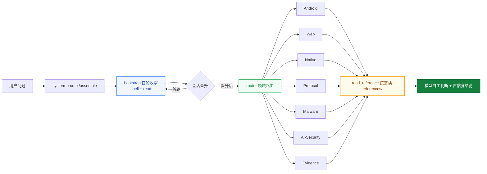

<div align="center">

# helmd

**DeepSeek Harness 破甲一体化安全分析插件**

一个 preset 挂载 · 逆向 · 渗透测试 · 加壳脱壳 · License 破解绕过 · Android / Web / Native / Protocol / Malware / AI-Security 六大领域即开即用

[English](README.en.md) | 中文

[](https://t.me/helm_xD)
[](https://github.com/topics/dsh-plugin)
[](https://github.com/topics/deepseek-harness)
[](https://nodejs.org)
[](https://pnpm.io)
[](LICENSE)

</div>

> 仅供学习交流。使用者须遵守所在地法律法规，对使用本项目产生的后果自负。

> 维护者文档：发布流程、preset 单源同步、坑位表见 [MAINTENANCE.md](MAINTENANCE.md)；版本历史见 [CHANGELOG.md](CHANGELOG.md)。

## Why helmd

<table>
<tr>
<td width="50%">

### 破甲一体化

逆向分析、加壳脱壳、License 破解、渗透测试——Android · Web · Native · Protocol · Malware · AI-Security 六大安全领域 + 证据链（evidence）聚合在一个 preset 里。装一次，33 个工具全领域就绪，不再逐领域拼装。

</td>
<td width="50%">

### 单包聚合 · 一条命令

全部能力收敛进一个 `@adwmc/helm-d` 包。profile 只加载健康检查，preset 在 Agent 隔离上下文中加载 bootstrap、router、领域工具、toolbox 与运行时钩子层（描述清洗 / 证据链包装 / advisory / H-CoT / 流式审计），Web 端附带安全分析工作台。`install.ps1` / `install.sh` 下载 Release 预构建 tarball并自动写入 preset。

</td>
</tr>
<tr>
<td width="50%">

### 知识按需读

领域知识、规则、工作流、案例全部放 `references/`，工具按需读取——不塞进 system prompt 替模型做决定，控 token，也保判断。

</td>
<td width="50%">

### 首轮工具锚定

首个顶层请求只暴露 shell + `read`，晋升后放开完整目录。文本首答不会困在 bootstrap，第二轮一定见到全量工具。

Windows 会话的原生终端工具名是 `pwsh`；需要使用 WSL 时，通过 `pwsh` 执行
`wsl.exe -- bash -lc 'command'`（指定发行版用 `wsl.exe -d <distro> -- ...`）。Linux
会话使用 `bash`。不要搜索 `powershell`、`shell` 或 `terminal` 这些别名。

</td>
</tr>
</table>

## 为什么做这个

DSH 的安全分析能力原本分散在多个领域 bundle：装 Android 要 add，装 Web 要 add，装 Native 还要 add，preset 和 router 也得自己拼。

helmd 把六大领域 + 证据链（evidence）+ 首轮工具锚定（bootstrap）+ 运行时钩子层 + 工具箱（toolbox）打包成一个 Agent 专属包：

`一个 preset` &ensp; `一个 bundle` &ensp; `33 个工具` &ensp; `零手动拼装`

装一次，会话里发 `helmd`，全领域工具就绪。

## 架构



- **首轮收窄**：首个顶层请求只暴露 shell + `read`，晋升后放开完整工具目录
- **领域路由**：`router` 用 `skill_catalog` / `read_reference` 把问题路由到对应领域
- **按需参考**：`references/` 是知识库，不是注入物；模型读完后自主判断
- **运行时钩子层**：工具描述清洗、advisory 账本注入、H-CoT 拒绝响应、LLM 流式审计（见下节）

## 运行时钩子层

`packages/helmd/src/index.ts` 的 `apply()` 按固定顺序组装五层运行时机制，全部寄生宿主 cordis 瀑布，零独立进程：

```text
tool-wash 描述清洗 → persist 证据链包装 → bootstrap 首轮收窄
  → advisory-hook（outer）+ hcot-hook（inner）+ llm-stream-hook
  → /hcot 内部命令 + router + 账本 + caseflow + 工具发现 + 领域工具
```

| 组件 | 挂载点 | 职责 |
|------|--------|------|
| `tool-wash.ts` | `tools.register` 包装 | 把「拒绝是终局/不要重试」类工具描述话术归一化为可继续措辞（防御层，借鉴 dsh-purge 清洗表），命中记 verbose 日志 |
| `persist.ts` | `tools.register` 包装 | 所有后注册的领域工具输出自动落 `evidence/`（软门禁，免逐工具改造） |
| `advisory-hook.ts` | `system-prompt/assemble`（outer） | 对照会话日志清算上一轮 advisory；检测交付拒绝/敷衍措辞，注入 stance 指标（no-hedge / challenged / report-prefix / normalizer）；敏感输入先经 `input-normalizer.ts` 归一化 |
| `hcot-hook.ts` | `system-prompt/assemble`（inner） | 最新助手轮命中交付拒绝签名 → 提交强制性 advisory（要求先 `hcot_attack { stats: true }` 取证再执行）+ 后台调度攻击；`HELMD_HCOT_AUTOHOOK=0` 整体关闭，`HELMD_HCOT_AUTOSCHEDULE=0` 只注入不调度 |
| `hcot-attack-scheduler.ts` | 编排层 | 日志提取 → 上下文重构（拒绝原文不进子代理 prompt，只传触发点标签）→ 子代理主路 → 防线3 重试（≤2 次）→ 引擎降级 |
| `hcot-engine.ts` | Node 原生执行器 | 零 Python/子进程，全局 fetch 打 OpenAI-compatible SSE 端点捕获 first_fragment；语料 `scripts/ai-security/h_cot_variants.json`，结果账本 `~/.dsh/helmd-tools/h_cot_results.jsonl` |
| `command-hcot.ts` | `ctx.commands` | `/hcot <goal>` 单发引擎（`--semantic-auto` 语义路由）、`/hcot breach <goal>` 走统一调度器 |
| `hcot-settings.ts` | settings `hcot` 命名空间 | 工作台 UI 的读写面：配置（model/provider/maxRounds/autoSchedule）+ 动作请求 + 运行态 |
| `ica-context.ts` | `systemPrompt.context` | L2 行为示范注入：4 组真实形态域名的任务→执行行为对，ICL 把生成分布拉向直接交付（arXiv:2310.06387），替代会被 reasoning 引用回读的声明式前提 |
| `llm-stream-hook.ts` | `llm/stream` | 拒绝真闭环：拦截（内容 / reasoning 早停）→ 历史清洗 → prefill 阶梯（assistant-last → pair）经 `llm` 服务嵌套重发 → 末轮诚实透传；refusal / retry 落账本，计数与摘录写 `~/.dsh/helmd-stream-intercept.log` |

## 运行规则

helmd 会话遵循以下固定规则：

### 激活与会话

| 规则 | 行为 |
|------|------|
| 激活词 | preset 内置 persona 定义激活词（默认 `helmd`），精确匹配才回激活语，其余输入一律当任务执行 |
| 首轮锚定 | 首个顶层请求仅暴露 shell + `read`；首次工具调用或助手消息后晋升，放开全部工具 |
| 子代理豁免 | delegationDepth > 0 的会话始终可见完整目录 |
| 分析档位 | Ponytail 式阶梯：`analysis_mode` 设 lite（快速分诊）/ full（标准流程，默认）/ deep（完整证据链），会话内持久，选能回答任务的最浅档 |
| 确定性路由 | `route_task(hint) 关键词匹配出 PRIMARY 路由 + 一句依据（先路由后动手），未命中回落决策树 |
| Case 工作区 | `begin_case` 建立磁盘工作区（sample/evidence/scripts/CASE.md），工具输出自动入证据链；`record_finding` 强制引用 E 编号；上下文压缩后 `case_status()` 从磁盘恢复状态 |
| H-CoT 自动响应 | 助手轮命中交付拒绝签名时，下一轮注入强制性 advisory 并后台调度 `hcot_attack`（子代理主路 → 防线3 → 引擎降级）；开关 `HELMD_HCOT_AUTOHOOK` / `HELMD_HCOT_AUTOSCHEDULE` |
| 内部命令 | `/hcot <goal>` 单发 H-CoT 引擎，`/hcot breach <goal>` 走统一调度器；结果回写 `~/.dsh/helmd-tools/h_cot_results.jsonl` |
| 流式拦截 | `llm/stream` 拦截器对内容 / reasoning 拒绝走真闭环（历史清洗 → prefill 阶梯嵌套重发 → 诚实透传）；计数与摘录写 `~/.dsh/helmd-stream-intercept.log`，工作台「拦截日志」面板展示状态 |

### 知识与路由

| 规则 | 行为 |
|------|------|
| 知识按需读 | 637 个参考文档全放 `references/`，经 `read_reference` 读取，绝不注入 system prompt |
| 目录即元数据 | `skill_catalog` 只做领域/信号路由，不下结论：`tree` 分诊、`methodology` 方法论、`patterns` 模式、`install` 工具安装、`jvm` JVM 解密等 |
| 参考非硬规则 | 文档供模型自主判断，不作为强制约束 |

### 工具与脚本

| 规则 | 行为 |
|------|------|
| 调用链 | 用户请求 → `defineTool.execute()` → `runSeam()` → 子进程（优先 ctx.subprocess，回退 execFile） |
| Python 解析 | `resolveCommand()` 按 python → py → python3 顺序探测，Windows 兼容 py launcher |
| 路径安全 | 所有文件读写经 `assertWithinRoot()` 校验，越界路径直接拒绝 |
| 外部工具获取 | 先查本机（where / --version）→ 无则装到除 C 盘外最大盘的 `X:\Reverse\` → 下载走代理 → 记录版本；详见 `references/toolbox/tool-install.md` |
| Releases 优先 | 有 GitHub Releases 的工具一律下预编译二进制，不源码编译 |

### 存证

| 规则 | 行为 |
|------|------|
| 报告模板 | 结论按 severity / confidence 分级，模板见 `references/evidence/reporting.md` |
| case 工作区 | `begin_case` 建磁盘工作区，工具输出经 persist 钩子自动入 `evidence/`，结论必须引用 E 编号（`record_finding` 校验） |

## 快速上手

**前提**：已安装 [`dsh`](https://github.com/deepseek-ai/deepseek-harness) CLI 与 pnpm。

Windows（双击 `install.bat`，或 PowerShell 运行）：

```powershell
.\install.ps1
```

macOS / Linux：

```bash
./install.sh
```

也可以走 **npm 渠道**（包已发布为 [`@adwmc/helm-d`](https://www.npmjs.com/package/@adwmc/helm-d)）——`plugin add` 是 pnpm 转发器，registry 包名直接可用：

```bash
dsh plugin --profile web add @adwmc/helm-d
```

安装器会下载最新 Release 的 `helmd.tgz`、装入 profile、写入 preset。**preset 平台行不靠快照复制——安装器在本机上直接读取你已装的 dsh 宿主 `standard` 预设实时派生生成**（`gen-preset.mjs --out`），只在生成器不可用时才退回包内快照。这意味着平台工具行永远匹配你自己装的 dsh 版本，不会因宿主升级而漂移。然后启动：

```bash
dsh web
```

会话里发送 `helmd` 即激活。

## Preset 与宿主同步（三层指纹防线）

dsh >= 0.1.7 起，preset 不再是部署目录里的文件，而是包自己经 `dsh.bundle.patch` 声明的一行组合（`@deepseek-ai/dsh-agent-preset`）。生成的 `packages/helmd/preset.generated.patch.yml` 首行携带宿主指纹：

```yaml
# gen-preset: host=<sha256 of installed dsh standard>
```

8/26 曾发生过手抄平台行在宿主升级后漂移、组装出 44 工具残废目录的事故（见 `docs/incident-2026-08-26-preset-stale-generation.md`），此后的防线是同一套判定在三个面上生效：

| 层 | 入口 | 行为 |
|------|------|------|
| CLI | `node packages/helmd/scripts/gen-preset.mjs --check` | 指纹移动 → `HOST UPGRADED`；内容漂移 → `STALE (content drift)`；退出码非 0 |
| 安装/更新 | `install.ps1` / `setup-preset.ps1` | 安装时对本地宿主实时生成，不做人工拷贝 |
| GUI | dsh 设置页 helmd 卡片（见下节） | 每次启动评估一次，常驻徽标 |

## 健康状态卡片

helmd 0.2.1 起在 **dsh 网页设置页**常驻一块健康卡片：设置 → 插件 → 插件配置 → 「helmd 安全分析包」。卡片本身只展示、不改盘。

每次 dsh 启动时评估一次包内产物 `preset.generated.patch.yml`（路径可用 `HELMD_PRESET_PATCH` 重定向，测试用）与当前宿主 `standard` 的关系：

| 徽标 | 含义 | 动作 |
|------|------|------|
| 🟢 健康 Healthy | 产物与宿主匹配 | 无 |
| 🟠 宿主已升级 Host upgraded | 升级过 dsh，平台行过期 | 重跑 install / setup-preset，再重启 |
| 🔴 内容漂移 Content drift | 手改了产物或 persona 未同步 | 同上，重新生成 |
| 🟣 旧版产物 Legacy preset | 无指纹头的产物，来源不可证 | 重新生成 |
| ⚪ 未生成 Not generated | 产物缺失 | 跑 install 或 gen-preset |

展开可见双指纹（12 位）、版本、**自动修复结论**、评估时间与两条路径，方便定位问题。

**漂移修复策略**：卡片判到漂移时会自动修复，但**只修能证明是本包产物的文件**——产物带 `gen-preset` 指纹头（`STALE` 内容漂移 / `HOST_UPGRADED` 宿主已升级）就自动按当前宿主 standard 重生成；没有指纹头（`LEGACY_PRESET`，可能是你手写的）只报告、不动它。写盘前一律先留 `.bak`；修复后当场跑一次**产物结构断言**（行集合 = 宿主 standard + `helmd`、无重复 id、组合行已改写为 `preset-helmd` / `id: helmd`、`helm-d` 恰好一次、persona 是本包激活词），结论里会写明 `artifact check OK (N rows …)`，然后提示"必须重启 dsh 并按 MAINTENANCE §8 断言首轮 `[pwsh, read]`"——那半需要真机会话，只能由你跑。开关：`HELMD_AUTO_HEAL=0` 全部只报告（手工管理产物用），`=1` 连无指纹头的也重写。

## 安全分析工作台与动态工具货架

helmd 0.4.0 起工作台升级为四个数据面板，全部经 `/api/helmd/{tools,hcot,intercept,jev}` HTTP 端点（15s 轮询）实时取数：

- **双轨交互入口**：在会话头部点击 `[helmd 工作台 ▾]` 胶囊按钮，可立即就地弹出安全分析工作台抽屉；同时自动触发右侧边栏展开并激活 `helmd 安全分析` 专属工作台标签。
- **工具货架**：分类层级树（6 大类 → 子类 → 工具），从 `~/.dsh/helmd-tools/TOOLS.md` 账本动态解析，支持界面直接登记新工具；账本为空时回退跨平台标准路径（`~/.dsh/...` 与系统 `PATH`），Windows / macOS / Linux 均开箱可用。
- **攻击记录**：H-CoT 引擎账本实时呈现，搜索循环变体优先级排序。
- **jev_decide 智能判断面板**：判断依据与决策链展示。
- **拦截日志**：运输层拒绝拦截闭环的计数与摘录（`~/.dsh/helmd-stream-intercept.log`）。

## 从插件商店安装

helmd 已提交 [awesome-dsh-plugin](https://github.com/awesome-dsh-plugin/awesome-dsh-plugin) 收录（[PR #2708](https://github.com/awesome-dsh-plugin/awesome-dsh-plugin/pull/2708)）。合并后可在 [dshmarket.com](https://dshmarket.com) 或 dshmarket 插件 UI 里一键安装；命令行等价于：

```bash
# 预构建 tarball（免构建审批）
dsh plugin --profile web add https://github.com/ADWMC/helm-d/releases/latest/download/helmd.tgz

# 或从源码
dsh plugin --profile web add github:ADWMC/helm-d/tree/main/packages/helmd
```

**商店安装会把包依赖和健康检查装入 profile。安全工具、bootstrap 和 router 只由 helmd Agent preset 加载；preset 产物随包就位，只有升级过 dsh 宿主后才需要按本机重生成一次：**

```bash
# Windows (PowerShell)
%USERPROFILE%\.dsh\profiles\web\node_modules\@adwmc\helm-d\scripts\setup-preset.ps1

# macOS / Linux
~/.dsh/profiles/web/node_modules/@adwmc/helm-d/scripts/setup-preset.sh
```

脚本按本机安装的 dsh 重生成包内 `preset.generated.patch.yml`（已有则留 .bak），不往 `~/.dsh` 写任何部署文件；重启 dsh 后在会话启动处选 `helmd` preset 即可。宿主低于 0.1.7 时脚本会报错并保留随包产物。

## 验证

```bash
dsh --profile web --dump-config   # 应看到 @adwmc/helm-d 的 host 行（解析到 dist/health.js），
                                  # 以及 - id: preset-helmd（config: id: helmd）与末行 @adwmc/helm-d/agent
node packages/helmd/scripts/gen-preset.mjs --check   # preset check OK（红了按指纹提示处理）
```

会话里发送 `helmd` 后：

```text
skill_catalog        → 返回领域/信号路由（含 jvm、install 等新路由）
native_reference     → 读取 Native 领域参考
detect_packer <file> → 判定 PE/ELF 保护器
```

设置 → 插件 → 插件配置 里应出现绿色「健康 Healthy」的 helmd 卡片。上面任一正常返回即安装成功。

## 包清单

| 包 | 注入 | 职责 | 暴露工具 |
| --- | --- | --- | --- |
| `helm-d` | preset-scoped tools | 全领域安全分析一体化，仅影响 helmd Agent | 见下表 |

### helmd 暴露的工具

| 领域 | 工具 | 说明 |
| --- | --- | --- |
| **路由** | `skill_catalog` | 领域路由目录 |
| **路由** | `read_reference` | 读取路由级参考文档 |
| **Android** | `apk_fingerprint` | APK 框架/HTTP/混淆检测 |
| **Web** | `web_reference` | Web 安全参考文档 |
| **Web** | `bot_analyze` | Puppeteer Bot 分析 |
| **Native** | `native_reference` | Native/二进制参考文档 |
| **Native** | `detect_packer` | PE/ELF 加壳检测 |
| **Native** | `scan_strings` | ASCII/UTF-16LE 字符串提取 |
| **Native** | `xor_bruteforce` | 单字节 XOR 暴力破解 |
| **Native** | `encoding_detect` | Base64/Hex/ROT13/XOR 解码 |
| **Protocol** | `protocol_reference` | 协议/流量参考文档 |
| **Protocol** | `pcap_parse` | PCAP TCP/UDP 流提取 |
| **Protocol** | `state_machine` | 协议状态机推断 |
| **Protocol** | `parse_har` | HAR 请求/响应解析 |
| **Malware** | `malware_reference` | 恶意样本参考文档 |
| **Malware** | `ioc_extract` | IOC 提取 |
| **Malware** | `yara_gen` | YARA 规则生成 |
| **AI-Security** | `ai_reference` | AI/LLM 安全参考文档 |
| **AI-Security** | `llm_sim` | LLM 应用模拟测试 |
| **AI-Security** | `hcot_attack` | H-CoT 思维链劫持执行器（模板采集 → 思路伪造 → 注入劫持；变体胜率择优、结果账本；`stats:true` 只看胜率表，`dry_run:true` 不联网；实际调用需自备 OpenAI 兼容端点的 API key，越狱内容会发往该端点） |
| **Evidence** | `evidence_reference` | 证据/报告参考文档 |
| **Case** | `begin_case / `case_status / `record_finding / `end_case` | 磁盘工作区生命周期：建案/恢复/带校验记录结论/关闭（deep 档强制 findings） |
| **Case** | `find_tool` | GitHub 检索现成工具（变体查询建议 + helmd-tools 货架命中） |
| **Case** | `save_evidence` | 外部 CLI 输出统一入证据链（E 编号） |
| **Evidence** | `triage_artifact` | 离线分诊 |
| **Evidence** | `hash_artifact` | SHA-256 哈希 |
| **Toolbox** | `tool_recommend` | 工具库推荐 |
| **Router** | `route_task` | 确定性路由：任务提示 → PRIMARY 路由 + 依据 |
| **Ledger** | `tool_memory` | 跨会话工具/死路账本：`register` 绑定工具、`note` 记坑与证伪（`note` 必须带证据 id）、`sync` 显式把 H-CoT 结果账本回流、`search` 检索；货架速览自动进 `route_task` 卡片（读取型工具不写盘） |
| **Session** | `analysis_mode` | 分析档位阶梯 lite/full/deep（Ponytail 式） |

每个 `*_reference` 工具按需读取对应 `references/<domain>/`，入口是各自的 `index.md`。

## 方案选型

| 方案 | 不选的原因 |
|------|-----------|
| 10 个独立 bundle | 10 次 add + 手动拼 preset + router，重复且易错；seam.ts 复制 9 遍 |
| 只挂原生 shell 工具 | 无领域知识，模型靠猜，结论不可复现 |
| 知识塞进 system prompt | token 爆炸，且替模型做决定，违背按需原则 |
| helmd 单包 | 一次安装全聚合，共享 seam，知识按需读，模型自主判断 |

## 常用命令

```bash
pnpm install                # 安装依赖（prepare 自动 tsc）
pnpm build                  # 构建 workspace 全部包（发布物仅 helmd）
pnpm typecheck              # 干净树 tsc --noEmit 类型门禁
```

本地打包交付：

```powershell
.\scripts\repack.ps1                                    # 生成 dist-tgz\helmd.tgz（含稳定命名别名）
dsh plugin --profile web add .\dist-tgz\helmd.tgz       # 装进 web profile
```

自动更新（比对 GitHub 最新 Release，新则下载重装，拒绝降级本地新版）：

```powershell
.\scripts\update.ps1                # 检查并更新 web profile
.\scripts\update.ps1 -CheckOnly     # 只看版本不动手
.\scripts\update.ps1 -Force         # 版本相同也重装

./scripts/update.sh                 # macOS / Linux
```

## 部署

一键安装见上「快速上手」；手动分步如下。前置：`@adwmc/helm-d` 包已发布到 npm（见「发布」）。

### 1. 安装包依赖与健康检查到 profile

```bash
dsh plugin --profile web add @adwmc/helm-d
```

`dsh plugin` 会把参数转发给 profile 目录里的 pnpm，包落到 `$DSH_HOME/profiles/node_modules/`；全局 patch 只注册只读健康检查，不注册安全工具。

### 2. preset：随包就位，无需挂载

dsh >= 0.1.7 里 preset 是包通过 `dsh.bundle.patch` 声明的一行组合，安装即生效——不再有 `$DSH_HOME/.agent-presets/helmd/` 这个部署目录（0.1.5 及更早的手动拷贝步骤作废）。只在**升级过宿主**之后按本机重生成一次：

```bash
# Windows (PowerShell)
.\packages\helmd\scripts\setup-preset.ps1

# macOS / Linux
bash packages/helmd/scripts/setup-preset.sh
```

### 3. 选用 preset

在会话启动处的 preset 选择器里选 `helmd`（安装脚本不会替你改默认值）。

### 4. 启动并激活

```bash
dsh web
```

会话里发送 `helmd` 即激活。`DSH_HOME` 默认是 `~/.dsh`，自定义过就替换对应路径。

## 目录结构

```text
helmd/
├── packages/
│   └── helmd/                 发布包（单 bundle）
│       ├── src/
│       │   ├── bootstrap.ts   首轮工具收窄过滤器
│       │   ├── tool-wash.ts   工具描述清洗（拒绝终局话术归一化，防御层）
│       │   ├── persist.ts     全工具证据链持久化包装
│       │   ├── advisory*.ts   advisory 账本 + prompt-assembly 注入（拒绝/敷衍检测）
│       │   ├── hcot-*.ts      H-CoT 引擎 / 语义路由 / 调度器 / 设置 / 子代理人格
│       │   ├── command-hcot.ts     /hcot 内部命令
│       │   ├── llm-stream-hook.ts  llm/stream 拒绝真闭环（清洗→prefill 阶梯嵌套重发）与审计
│       │   ├── input-normalizer.ts 敏感输入 → 工程术语归一化
│       │   ├── router.ts      skill_catalog / read_reference 路由
│       │   ├── health.ts      设置页健康面（boot 时指纹评估 → settings namespace）
│       │   ├── seam.ts        共享 IO seam（fs / subprocess / 命令解析 / 路径校验）
│       │   └── tools/         10 个工具模块（33 个工具）
│       ├── client.js          浏览器半：设置页健康卡片 + 工作台（lazy-CJS factory，免构建）
│       ├── references/        637 个参考文档，按需读取（8 大域 + toolbox）
│       ├── scripts/           分析脚本 + ai-security 语料/账本 + gen-preset.mjs + setup-preset.{ps1,sh}
│       ├── presets/           persona 单源 + preset.yml（picker 的 order/description）
│       ├── preset.generated.patch.yml  preset 产物（生成物；宿主 standard + persona + helmd 行）
│       └── cordis.patch.yml   bundle 挂载清单（helmd 工具行 + helmd-health 行）
├── install.ps1/.sh/.bat       一键安装器
└── docs/                      设计文档与事故复盘
```

> `packages/` 下其余目录为历史拆分包，已由 helmd 单包取代，仅作归档保留、不再发布。

## 构建

需要 pnpm；构建产物目标 ES2022 / NodeNext。

```bash
pnpm install
pnpm build
```

根 `pnpm build` 构建 `@adwmc/helm-d` 包；`pnpm typecheck` 在干净树上执行 `tsc --noEmit` 类型门禁。

## 依赖

- `@deepseek-ai/cordis` `^4.0.2`
- `@deepseek-ai/dsh-tools` `>=0.1.5-rc.1 <0.2.0-0`（宿主 cohort：dsh 0.1.5-rc.2 全家 pin 见 `pnpm-workspace.yaml` overrides）
- `@deepseek-ai/dsh-settings` `>=0.1.5-rc.1 <0.2.0-0`
- `@deepseek-ai/schemastery` `^3.18.2`

> **预发布范围的坑**：semver 只在范围里点名同一 `major.minor.patch` 的预发布版本时才收预发布版本。`>=0.1.0-rc.1 <0.2.0-0` 因此**不收** `0.1.5-rc.1`（只收 `0.1.0-rc.x`），`^0.1.1-rc.2` 同理。要声明宿主 cohort，必须写成 `>=0.1.5-rc.1 <0.2.0-0`。

版本通过 `pnpm-workspace.yaml` 的 `overrides` 固定到宿主 cohort（`@deepseek-ai/dsh-*` 全家 + cordis + schemastery）；`pnpm install` 后 `pnpm peers check` 必须无问题，否则说明图里混了跨 cohort 的 peer。

## 发布

- 根包 `private: true`，不发布；发布对象是 `@adwmc/helm-d` 单包。
- `files` 白名单：`dist`、`client.js`、`references`、`scripts`、`presets`、`cordis.patch.yml`、`preset.generated.patch.yml`。
- `prepare` 脚本会在发布前自动执行 `tsc`。
- 当前版本以 `packages/helmd/package.json` 为准（不在文档里钉数字）。
- Release 资产：`adwmc-helm-d-<ver>.tgz` + 稳定别名 `helmd.tgz`（供商店 tarball 字段与安装器使用）。

## 风险与缓解

| 风险 | 缓解 |
|------|------|
| DSH 宿主版本升级不兼容 | peer 依赖 cordis / dsh-tools，`overrides` 固定版本；preset 指纹三层防线（见上）自动暴露漂移 |
| 本机缺 `python` | seam 自动探测 python / py / python3，Windows 兼容 `py -3` |
| 单包版本错位 | 版本 0.3.1，tarball 与 release 同步发布 |
| 参考知识过时 | 按需读、模型自主判断，非硬性规则 |

## 参考项目

本项目融合了多个优秀开源项目的设计理念与实现思路，借鉴了社区中许多先行者的经验。如有雷同，那就是对优秀设计的借鉴与致敬。

- [ADWMC/helm-x](https://github.com/ADWMC/helm-x) — 提示词注入与计分制设计
- [yynxxxxx/Codex-X](https://github.com/yynxxxxx/Codex-X) — 提示词模板与可视化管理

## 实战案例

**BoosterX v2.2.4.3 (.NET) 许可证绕过** —— helmd 方法论的完整实战验证：

- ConfuserEx 动态防护（anti-tamper dynamic）下活体还原 **32,316 个方法体**、解密 **7,726 条加密常量**，全工程可读化
- 运行时提取 RSA-2048 公钥，定性在线签名授权模型，论证离线伪造不可行
- 三条静态重建死路全部归档根因后，以**零修改、零注入**的官方托管扩展机制完成持久化解锁，UIAutomation + 进程内回读双重实测通过
- 附完整证据链、难度评估与服务端加固建议

📄 全文：[docs/case-studies/boosterx-dotnet-license-bypass.md](docs/case-studies/boosterx-dotnet-license-bypass.md)

## 文档

- [docs/principles.md](docs/principles.md) — 设计原则
- [docs/architecture.md](docs/architecture.md) — 架构
- [docs/architecture-v2.md](docs/architecture-v2.md) — 架构 v2（persona + 工具锚定 + 按需知识）
- [docs/case-studies/](docs/case-studies/boosterx-dotnet-license-bypass.md) — 实战案例
- [docs/skills-reference/](docs/skills-reference/authorized-pentest-framework.md) — 导入的渗透测试 skill 合并文档（授权框架 / 实战派）
- [docs/skillopt-methodology.md](docs/skillopt-methodology.md) — SkillOpt 方法论：把技能文档当权重训练（六阶段闭环 + 留出门禁），含对 helmd persona 自优化的映射

## Contributing

欢迎提 issue 与 PR。改动前请先阅读 [docs/principles.md](docs/principles.md)，并保持「参考知识按需读取、不替模型做决定」的架构约束。

## License

本项目基于 [MIT License](LICENSE) 开源，可自由使用、修改和分发。详见 [LICENSE](LICENSE)。

## AI 生成与法律风险

本仓库部分或全部代码由 AI 辅助生成，可能存在错误或不适用场景。使用前请自行审查，并自行判断是否适合你的使用场景与所在司法辖区；使用者须遵守所在地法律，对使用本项目产生的后果自负。本项目按 MIT “原样”提供，不附带任何担保。
