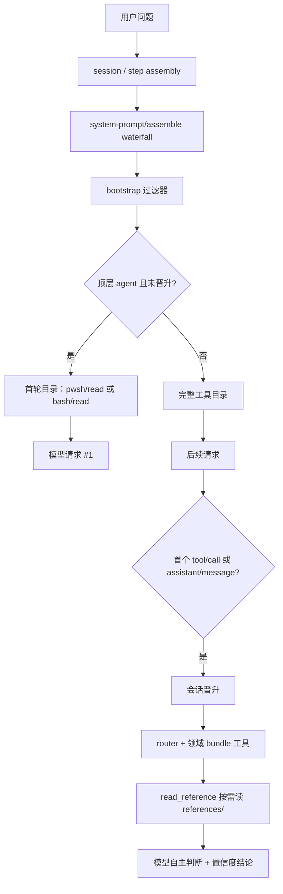

# 架构 v2：单一 persona + 工具锚定 + 按需知识

## 0. 结论

- 第一注入 = 每个 preset 的 persona：`# 安全分析工程代理工作规范`，`complete: true`、`includeRuntimeContext: false`。
- 领域 skill 只存在于 `references/`，通过 `read_reference` 按需读取；skill 内不保留激活词、强制开场白或隐藏启动协议。
- 工具目录由 `@dsh-security/bootstrap` 首轮收窄，晋升后放开。
- 每个结论必须带置信度，并注明依据。

## 1. 设计目标

1. 唯一系统提示：persona 是唯一注入 prompt，便于审计。
2. 工具与知识分离：领域能力注册为工具，知识放 `references/`。
3. 无 skill 内激活协议：所有"激活词 / 强制进入某模式"内容删除。
4. 可验证：构建产物可 `node --check`，preset 可真实 mount。

## 2. 第一注入（单一事实源）

每个 `agent.cordis.yml` 只有一段系统提示：

```yaml
- id: persona
  name: '@deepseek-ai/dsh-persona'
  config:
    text: |
      # 安全分析工程代理工作规范
      ...
    complete: true
    includeRuntimeContext: false
```

这段文本是 helmd 的身份与纪律层，不展开领域知识；领域规则在工作时按需读取。

## 2.1 两层注入模型

| 层 | 载体 | 内容 | 注入方式 |
|---|---|---|---|
| Layer 1 | `@deepseek-ai/dsh-persona` | 安全身份与纪律锚点 | 系统提示，`complete: true` |
| Layer 2 | `dsh-agent-instructions` + `AGENTS.md` | 完整工程代理工作规范 | 按 `AGENTS.md` 自动加载，作为 `<system-reminder>` |

- Layer 1 保持精简：只放安全边界、身份、按需读取原则、置信度要求。
- Layer 2 放原来的完整规范：可拆分到项目 `AGENTS.md`，由已存在的 `agent-instructions` 行加载。
- `prompt-deepseek优化版.md` 不进入 Layer 1 或 Layer 2：它的内容会让模型绕过安全边界。

## 3. AI 遇到一个问题的调用链



## 4. 组件职责

| 组件 | 注入方式 | 是否进入 system prompt | 职责 |
|---|---|---|---|
| persona | preset 行 | 是，唯一系统提示 | 身份、纪律、置信度要求 |
| bootstrap | preset 行，`inject=['systemPrompt']` | 否 | 首轮工具收窄，晋升后放开 |
| router | preset 行，`inject=['tools']` | 否 | 注册 `skill_catalog` / `read_reference` |
| 领域 bundle | preset 行，`inject=['tools']` | 否 | 注册领域工具，描述指向 `references/` |
| references | 工具读取 | 否，按需读取 | 领域规则、工作流、脚本说明 |

## 5. 目录结构

```text
helmd/
├── packages/
│   ├── bootstrap/
│   ├── router/
│   ├── skill-android/
│   ├── skill-web/
│   ├── skill-native/
│   ├── skill-protocol/
│   ├── skill-malware/
│   ├── skill-ai-security/
│   └── skill-evidence/
├── presets/
│   └── full-reverse/
└── docs/
    ├── architecture.md
    └── architecture-v2.md
```

## 6. 本轮删除项

- `skill-evidence/references/reverse-flow-skill.md`：删除 `Activation protocol`、`真心为你` 与强制"进入逆向模式"开场白。
- `skill-evidence/references/prompting.md`：删除 `Startup prompt` 代码块及 `真心为你` 开场白。
- 全仓库无 `Activation protocol` / `真心为你` / 其他 skill 内激活词。

## 7. 验证

- 9 个 `dist/index.js` 通过 `node --check`。
- `--profile web` 真实启动成功。
- `helmd` (full-reverse) preset 通过 `session.create` 真实 mount。
- 搜索 skill 引用，无剩余激活词。

## 8. 残余风险

- 首轮只暴露 `pwsh/read` 或 `bash/read`、次轮放开完整目录的行为未跑真实模型请求验证；需要用户发一条消息观察工具目录。
- 置信度：构建与 mount 为高；首轮工具锚定行为为中。
