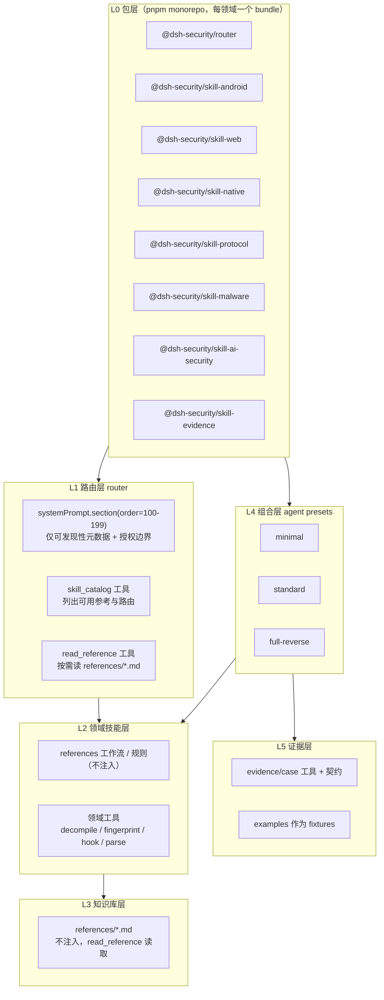

# 架构设计

> 目标：把 `Security-Skill-plan-c`（包 / 分层骨架）与 `r0crawl_skills-main`（目录 / 路由 / 证据内容）整合成一个可安装、可组合、可渐进披露的 dsh 插件体系。核心原则见 `principles.md`。

## 0. 定位

- 每个领域技能 = 一个 dsh bundle（npm 包 + `dsh.bundle.patch`）。
- 每个 bundle 自包含：`src/`（插件代码）+ `references/`（知识库）+ `scripts/`（工具脚本）。
- 知识不注入 prompt，靠 `read_reference` 工具按需读，控 token。
- 组合靠 agent preset，按需挂 bundle，不全量加载。

## 1. 分层



## 2. 目录结构

```text
dsh-security/                          # pnpm workspace
├── pnpm-workspace.yaml
├── packages/
│   ├── router/
│   │   ├── package.json               # name: @dsh-security/router, dsh.bundle.patch
│   │   ├── cordis.patch.yml
│   │   ├── src/index.ts
│   │   └── references/routes.md       # 路由表（参考，不注入）
│   ├── skill-android/
│   │   ├── package.json
│   │   ├── cordis.patch.yml
│   │   ├── src/index.ts
│   │   ├── references/                # mobile-analysis 归并
│   │   └── scripts/                   # fingerprint / decompile / frida
│   ├── skill-web/
│   ├── skill-native/
│   ├── skill-protocol/
│   ├── skill-malware/
│   ├── skill-ai-security/
│   └── skill-evidence/
├── presets/
│   ├── minimal/agent.cordis.yml
│   ├── standard/agent.cordis.yml
│   └── full-reverse/agent.cordis.yml
└── examples/                          # fixtures
```

## 3. 每层关键件

### 3.1 L0 bundle manifest

```json
{
  "name": "@dsh-security/skill-android",
  "version": "0.1.0",
  "type": "module",
  "main": "src/index.js",
  "files": ["src", "references", "scripts", "cordis.patch.yml"],
  "dsh": { "bundle": { "patch": "./cordis.patch.yml" } }
}
```

```yaml
# cordis.patch.yml
- insert:
    - id: skill-android
      name: '@dsh-security/skill-android'
```

### 3.2 L1 router 插件（prompt 仅保留可发现性元数据 + 授权边界）

```ts
import type { Context } from '@deepseek-ai/cordis'
import { defineTool } from '@deepseek-ai/dsh-tools'

export const name = 'security-router'
export const inject = ['systemPrompt', 'tools']

export function apply(ctx: Context) {
  ctx.systemPrompt.section({
    name: 'security-discovery',
    order: 110,
    text: [
      'Security references are available on demand.',
      'When a task needs a technique, rule, or workflow, call skill_catalog or read_reference instead of assuming.',
      'Authorized scope: only targets the user is authorized to test.',
    ].join('\n'),
  })

  ctx.tools.register(defineTool({
    name: 'skill_catalog',
    description: 'List available reference topics and when to read them.',
    parameters: { domain: { type: 'string', required: false } },
    output: { schema: { type: 'string' }, render: (_a, v) => [{ type: 'text', text: v }] },
    async execute({ domain }) {
      return domain ? catalog[domain] : Object.values(catalog).join('\n')
    },
  }))

  ctx.tools.register(defineTool({
    name: 'read_reference',
    description: 'Read a reference doc on demand; apply your own judgment.',
    parameters: { path: { type: 'string', required: true } },
    output: { schema: { type: 'string' }, render: (_a, v) => [{ type: 'text', text: v }] },
    async execute({ path }) {
      const abs = resolve(refRoot, path)
      if (!abs.startsWith(refRoot)) throw new Error('path out of scope')
      return await readFile(abs, 'utf8')
    },
  }))
}
```

### 3.3 L2 领域技能层

领域 bundle 只注册自己的领域工具；规则与工作流进 `references/`，不注入：

```ts
export const name = 'skill-android'
export const inject = ['tools']

export function apply(ctx: Context) {
  ctx.tools.register(defineTool({
    name: 'apk_fingerprint',
    description: 'Detect APK framework / HTTP stack / obfuscation.',
    parameters: { apk: { type: 'string', required: true } },
    output: { schema: { type: 'string' }, render: (_a, v) => [{ type: 'text', text: v }] },
    async execute({ apk }) { return runScript('scripts/fingerprint.sh', apk) },
  }))
}
```

### 3.4 L3 知识库层

| 原仓库内容 | 落点 |
|---|---|
| secplan `references/mobile-analysis/*` | `skill-android/references/` |
| secplan `references/web-analysis/*` | `skill-web/references/` |
| secplan `references/binary-analysis/*` | `skill-native/references/` |
| secplan `references/ai-security/*` | `skill-ai-security/references/` |
| r0crawl 196 个 leaf SKILL.md | 按领域归并成 `references/<topic>.md` |
| r0crawl `references/tool-matrix.md` | `router/references/tool-matrix.md` |

### 3.5 L4 组合层

```yaml
# presets/standard/agent.cordis.yml
- name: '@deepseek-ai/dsh-base'
- name: '@dsh-security/router'
- name: '@dsh-security/skill-android'
- name: '@dsh-security/skill-web'
- name: '@dsh-security/skill-native'
- name: '@dsh-security/skill-evidence'
```

装到 `~/.agent-presets/`，会话选择器里选 preset。`minimal` 只挂 router + evidence，`full-reverse` 挂全部。

### 3.6 L5 证据层

`skill-evidence` 注册证据契约（作为 reference）+ case 工具；`examples/` 转测试 fixtures。

## 4. 层顺序

生效配置逐层叠加，后应用者胜：

1. preset 的 `bundles` 列表（按加入顺序）
2. profile 自己的 `cordis.patch.yml`
3. `$DSH_HOME/cordis.patch.yml`
4. 每个 `--patch` overlay

## 5. 落地清单

1. 建 pnpm workspace + 7 个 bundle 骨架（先做 router + skill-android 验证）。
2. 修已知缺陷：r0crawl `index_skills.py` 描述列为空（regex 只抓单行）；secplan description 超 lint。
3. 把 196 个 leaf 按领域归并进 `references/`，不 1:1 建 196 个包。
4. 写 3 个 preset 到 `~/.agent-presets/`。
5. 用 `dsh --profile <name> --dump-config` 验证层顺序，再启动。
