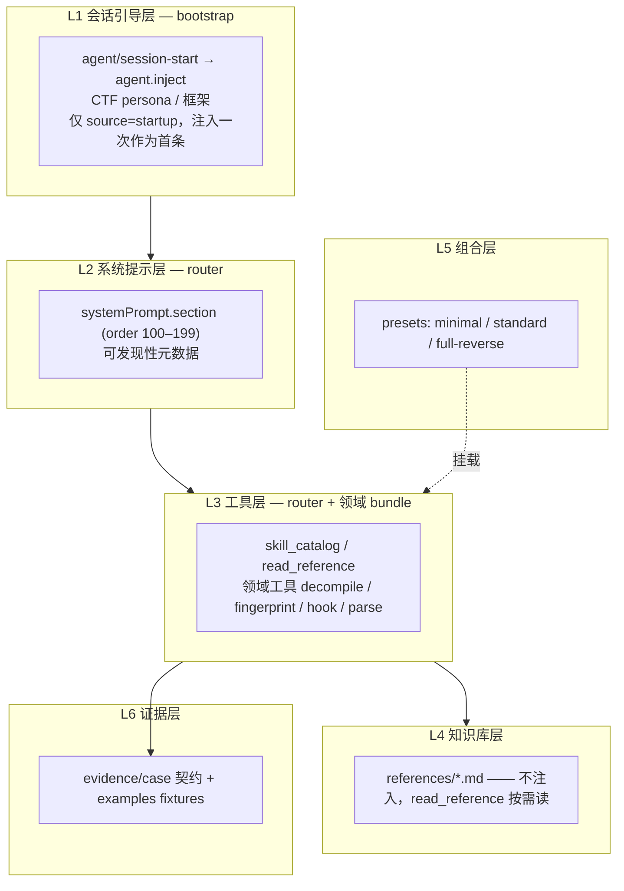

# 架构设计

> 目标：把 `Security-Skill-plan-c`（包 / 分层骨架）与 `r0crawl_skills-main`（目录 / 路由 / 证据内容）整合成可安装、可组合、可渐进披露的 dsh 插件体系。
> 本版已对齐 deepseek-harness 真实扩展点（`agent/session-start`、`systemPrompt`、`ctx.tools`、agent preset），并新增「会话引导层」承载 persona 首条注入。核心原则见 `principles.md`。

## 0. 定位

- 每个领域技能 = 一个 dsh bundle（npm 包 + `dsh.bundle.patch`）。
- 每个 bundle 自包含：`src/`（插件代码）+ `references/`（知识库）+ `scripts/`（工具脚本）。
- 知识不注入 prompt，靠 `read_reference` 工具按需读，控 token。
- persona / 框架只在全新会话注入一次（首条）；系统提示只放可发现性。

## 1. 三个扩展面

harness 给插件三类扩展点，helm-d 各占一个，互不越界：

| 扩展面 | harness hook | 承载 | 触发时机 |
|---|---|---|---|
| 首条注入 | `agent/session-start` + `agent.inject()` | persona / CTF 框架 | 全新会话一次（`source='startup'`） |
| 系统提示 | `ctx.systemPrompt.section()` | 可发现性元数据 | 每个 step 组装 |
| 按需知识 | `ctx.tools.register()` + `references/` | 领域规则 / 工作流 / 工具用法 | 模型调用工具时 |

三者分工：首条注入负责「是谁 / 干什么」（身份层）；系统提示负责「能查到什么 / 边界在哪」（发现层）；按需知识负责「具体怎么做」（知识层）。前两层都不替模型下结论。

## 2. 分层



## 3. 目录结构

```text
helm-d/                          # pnpm workspace
├── pnpm-workspace.yaml
├── packages/
│   ├── bootstrap/               # L1 会话引导（首条注入）
│   │   ├── package.json         # name: @dsh-security/bootstrap
│   │   ├── cordis.patch.yml
│   │   ├── src/index.ts         # agent/session-start → agent.inject
│   │   └── prompt.md            # persona 提示词（自包含，随包分发）
│   ├── router/                  # L2 系统提示 + L3 路由工具
│   │   ├── package.json         # name: @dsh-security/router
│   │   ├── cordis.patch.yml
│   │   ├── src/index.ts
│   │   ├── prompt.md            # 系统提示词（工程代理工作规范 二改）
│   │   └── references/routes.md # 路由表（参考，不注入）
│   ├── skill-android/           # L3 领域工具
│   │   ├── src/index.ts
│   │   ├── references/          # mobile-analysis 归并
│   │   └── scripts/             # fingerprint / decompile / frida
│   ├── skill-web/
│   ├── skill-native/
│   ├── skill-protocol/
│   ├── skill-malware/
│   ├── skill-ai-security/
│   └── skill-evidence/          # L6 证据
├── presets/
│   ├── minimal/agent.cordis.yml
│   ├── standard/agent.cordis.yml
│   └── full-reverse/agent.cordis.yml
└── examples/                    # fixtures
```

## 4. 每层关键件

### 4.1 L1 会话引导（首条注入）

全新会话开始时（`agent/session-start`，`source='startup'`）注入一次 persona。用 `agent.inject()` 而不是 `followup()`/`steer()`：注入内容不唤醒 driver，会与第一条用户消息在同一首个 step 被一起认领，成为模型可见历史的首条。

```ts
export const name = 'helm-x-bootstrap'

export function apply(ctx: Context): void {
  ctx.on('agent/session-start', ({ agent, source }) => {
    if (source !== 'startup') return
    agent.inject(createUserMessage({
      content: [{ type: 'text', text: prompt }],
      source: { kind: 'plugin', plugin: name },
    }))
  })
}
```

### 4.2 L2 系统提示（工程纪律 + 可发现性，文本在 `prompt.md`）

```ts
export const name = 'security-router'
export const inject = ['systemPrompt', 'tools']

export function apply(ctx: Context): void {
  ctx.systemPrompt.section({
    name: 'security-system-prompt',
    order: 110,
    text: promptText, // 来自 prompt.md
  })
  // ...
}
```

### 4.3 L3 工具层

`router` 注册路由工具，领域 bundle 注册领域工具；规则与工作流进 `references/`，不注入：

```ts
// router：按需路由
ctx.tools.register(defineTool({ name: 'skill_catalog', /* ... */ }))
ctx.tools.register(defineTool({ name: 'read_reference', /* 读 router/references */ }))

// 领域 bundle：只注册自己的工具，且各带一个 <domain>_reference 读自己的 references/
ctx.tools.register(defineTool({ name: 'native_reference', /* 读 skill-native/references */ }))
// 领域 bundle：只注册自己的工具
ctx.tools.register(defineTool({
  name: 'apk_fingerprint',
  description: 'Detect APK framework / HTTP stack / obfuscation. Read references/fingerprint.md for interpretation.',
  parameters: { apk: { type: 'string', required: true } },
  /* execute -> runScript('scripts/fingerprint.sh', apk) */
}))
```

### 4.4 L4 知识库层

| 原仓库内容 | 落点 |
|---|---|
| secplan `references/mobile-analysis/*` | `skill-android/references/` |
| secplan `references/web-analysis/*` | `skill-web/references/` |
| secplan `references/binary-analysis/*` | `skill-native/references/` |
| secplan `references/ai-security/*` | `skill-ai-security/references/` |
| r0crawl 196 个 leaf SKILL.md | 按领域归并成 `references/<topic>.md` |
| r0crawl `references/tool-matrix.md` | `router/references/tool-matrix.md` |

### 4.5 L5 组合层

```yaml
# presets/standard/agent.cordis.yml
- name: '@deepseek-ai/dsh-base'
- name: '@dsh-security/bootstrap'
- name: '@dsh-security/router'
- name: '@dsh-security/skill-android'
- name: '@dsh-security/skill-web'
- name: '@dsh-security/skill-native'
- name: '@dsh-security/skill-evidence'
```

`minimal` = bootstrap + router + evidence；`full-reverse` 挂全部。bootstrap 置于 `dsh-base` 之后、`router` 之前，保证任何 preset 都会先注入 persona 再组装系统提示。

### 4.6 L6 证据层

`skill-evidence` 注册证据契约（作为 reference）+ case 工具；`examples/` 转测试 fixtures。

## 5. 层顺序

生效配置逐层叠加，后应用者胜：

1. preset 的 `bundles` 列表（按加入顺序）
2. profile 自己的 `cordis.patch.yml`
3. `$DSH_HOME/cordis.patch.yml`
4. 每个 `--patch` overlay

## 6. 落地清单

- ✅ pnpm workspace + bundle 骨架（bootstrap / router / skill-android 已落地）
- ✅ bootstrap 首条注入 + 三 preset 挂载
- ✅ 6 个领域 bundle 填充（skill-web / native / protocol / malware / ai-security / evidence）：references（secplan 按域 + reverse-flow + r0crawl 顶层）+ scripts（secplan / r0crawl / reverse-flow）+ 领域工具（`<domain>_reference` 按需读 + CLI 工具）
- ✅ 196 个 r0crawl leaf SKILL.md 按领域归并进 `references/r0crawl-<domain>.md`（7 域，不 1:1 建包）
- ✅ 每个 bundle 生成 `references/index.md` 可发现索引
- ⬜ 修 r0crawl `index_skills.py` 描述列为空（regex 只抓单行）；secplan description 超 lint
- ⬜ 写 3 个 preset 到 `~/.agent-presets/`
- ⬜ 用 `dsh --profile <name> --dump-config` 验证层顺序，再启动


