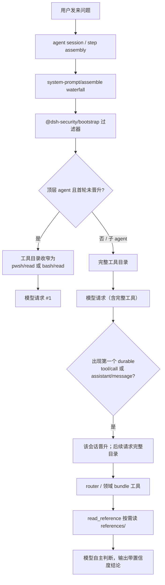

# 架构设计（对齐 dsh-anchored-standard）

> **状态（0.3.x）**：本文描述的 persona / bootstrap / 按需知识模型仍然成立，但发布形态已是
> 单包 `@dsh-security/helmd`（多 bundle preset 已归档，见仓库根 README「目录结构」），
> 并新增了**运行时钩子层**（本文 §4.6）。注入模型的演进另见 [architecture-v2.md](architecture-v2.md)。

> 本版按 [dsh-anchored-standard](https://github.com/xiaobright/dsh-anchored-standard) 的 preset 模型重写：
> persona 由 `@deepseek-ai/dsh-persona` 以 `complete: true` 提供；首轮工具目录由
> `@dsh-security/bootstrap` 在 `system-prompt/assemble` 瀑布中过滤；router 只注册工具，不再注入系统提示段。

## 0. 定位

- 领域知识 = 每个领域 bundle 的 `references/`，通过 `read_reference` 按需读，不注入 prompt。
- 工程纪律 = `@deepseek-ai/dsh-persona` 的 `complete` 文本（`packages/router/prompt.md` 的规范化内容）。
- 首轮工具锚定 = `@dsh-security/bootstrap`，首个顶层请求只暴露 `pwsh/read` 或 `bash/read`。
- 后续轮次 = 完整 Standard 工具目录 + helmd 路由/领域工具。

## 1. AI 遇到一个问题的调用链



顺序说明：

1. preset 挂载时注册 `@deepseek-ai/dsh-persona`（complete）与 `@dsh-security/bootstrap`。
2. 每个 step 组装时，`dsh-system-prompt` 先按 scope 收集工具，再走 `system-prompt/assemble` 瀑布。
3. bootstrap 过滤器读取 `assembled.tools`，依据会话是否已晋升决定是否裁剪。
4. 晋升依据 durable session events，默认 `promoteOn: either`：
   - 顶层 agent 首个请求看到 bootstrap 目录；
   - 只要出现过一次 `tool/call` 或 `assistant/message`，下一次请求开始看到完整目录；
   - 子 agent（`delegationDepth > 0`）永远直接看到完整目录。
5. 完整目录包含 Standard 工具 + `@dsh-security/router`（`skill_catalog` / `read_reference`）+ 各领域 bundle 工具。
6. 领域知识在 `references/`，模型按需读取，参考内容不替模型下结论。

置信度：上述调用链基于已安装 rc.6 的 `dsh-system-prompt` / `dsh-agent` 类型与参考仓库源码，**高**；仅“rc.6 与参考 rc.5 在行 id/config 上的启动兼容性”需实际启动验证，**中**。

## 2. 三层扩展面

| 层 | 机制 | 内容 | 是否注入 prompt |
|---|---|---|---|
| 身份/纪律 | `@deepseek-ai/dsh-persona` `complete: true` | 工程代理工作规范（中文） | 是，作为唯一系统提示 |
| 工具锚定 | `@dsh-security/bootstrap` `system-prompt/assemble` | 首轮 shell/read 过滤 | 否，只改工具目录 |
| 按需知识 | `router` + 领域 bundle 的 `ctx.tools.register` | 路由、领域工具、`references/` | 否，工具调用时读取 |

## 3. 目录结构

> 以下为 0.2.x 多 bundle 形态（历史存档）；0.3.x 单包结构见根 README「目录结构」一节。

```text
helmd/
├── packages/
│   ├── bootstrap/               # 首轮工具锚定（不再做首条消息注入）
│   │   ├── src/index.ts         # system-prompt/assemble 过滤器
│   │   ├── cordis.patch.yml
│   │   └── package.json
│   ├── router/                  # 路由工具（不再注册系统提示段）
│   │   ├── src/index.ts         # skill_catalog / read_reference
│   │   ├── references/
│   │   └── package.json
│   ├── skill-android/           # 领域 bundle
│   ├── skill-web/
│   ├── skill-native/
│   ├── skill-protocol/
│   ├── skill-malware/
│   ├── skill-ai-security/
│   └── skill-evidence/
├── presets/
│   ├── minimal/
│   │   ├── preset.yml
│   │   └── agent.cordis.yml
│   ├── standard/
│   │   ├── preset.yml
│   │   └── agent.cordis.yml
│   └── full-reverse/
│       ├── preset.yml
│       └── agent.cordis.yml
└── docs/
```

## 4. 关键组件

### 4.1 persona（`@deepseek-ai/dsh-persona`）

preset 中：

```yaml
- id: persona
  name: '@deepseek-ai/dsh-persona'
  config:
    text: |
      # 安全分析工程代理工作规范
      ...
    complete: true
    includeRuntimeContext: false
```

`complete: true` 使该文本成为唯一系统提示，压制 harness identity 与 per-tool guidance；工具 schema 与运行时约束仍保留。
`includeRuntimeContext: false` 不把 runtime context 自动塞进 system prompt，任务和仓库规则交由用户消息与显式文件读取。

### 4.2 首轮工具锚定（`@dsh-security/bootstrap`）

```yaml
- id: tool-bootstrap
  name: '@dsh-security/bootstrap'
  config:
    shellTools: [bash, pwsh]
    commonTools: [read]
    promoteOn: either
```

实现要点：

- `export const inject = ['systemPrompt']`。
- 监听 `system-prompt/assemble`，`await next()` 后过滤 `assembled.tools`。
- 仅在未晋升的顶层 agent 上过滤；子 agent、无 agent context、会话已晋升时返回原样。
- 缺失 bootstrap 工具或过滤异常时降级为完整目录并一次性 warning，不 brick 会话。

### 4.3 路由工具（`@dsh-security/router`）

- `inject = ['tools']`。
- 注册 `skill_catalog`、`read_reference`。
- 不再 `ctx.systemPrompt.section(...)`。

### 4.4 领域 bundle

各领域 bundle 保持 `ctx.tools.register(defineTool(...))` 结构，工具描述指向 `references/`，知识不注入 prompt。

### 4.5 presets

- `minimal`：Standard 行 + router + evidence。
- `standard`：Standard 行 + router + android/web/native + evidence。
- `full-reverse`：Standard 行 + router + 全部领域 bundle + evidence。
- 每个 preset 都有 `preset.yml`（name/description/order）和 `agent.cordis.yml`。

### 4.6 运行时钩子层（0.3.x，单包形态）

单包 `packages/helmd/src/index.ts` 的 `apply()` 按固定顺序组装（顺序有语义：清洗与持久化包装必须先于领域工具注册）：

```text
applyDescriptionWash   工具描述清洗：拒绝终局话术 → 可继续措辞（防御层，命中记 verbose 日志）
applyPersistenceWrap   证据链包装：后注册工具输出自动落 evidence/（软门禁）
applyBootstrapFilter   首轮收窄：shell + read，晋升后放开（§4.2）
registerAdvisoryHook   system-prompt/assemble outer：清算上一轮 advisory、
                       拒绝/敷衍检测 → stance 指标注入（敏感输入先过 input-normalizer）
registerHcotHook       system-prompt/assemble inner：交付拒绝签名 → 强制性 advisory
                       （先 hcot_attack { stats: true } 取证）+ 后台调度攻击
registerLlmStreamHook  llm/stream：首窗口拒绝签名旁路替换，审计写 ~/.dsh/helmd-stream-intercept.log
applyHcotCommand       /hcot 内部命令（单发引擎 / breach 统一调度器）
registerRouterTools …  router / 账本 / caseflow / 工具发现 / 领域工具（33 个）
```

配套数据面：H-CoT 变体语料 `scripts/ai-security/h_cot_variants.json`（纯数据）；
结果账本 `~/.dsh/helmd-tools/h_cot_results.jsonl`；设置命名空间 `hcot`（工作台 UI 的唯一读写通道）。
自动检查：`hcot-refusal` / `llm-stream` / `tool-catalog`（含 /hcot 注册断言）等见 `scripts/checks/`。

## 5. 与参考仓库的差异

| 项 | dsh-anchored-standard | helmd |
|---|---|---|
| persona text | 固定英文一句 | helmd 工程代理工作规范（中文） |
| bootstrap 插件 | `./tool-bootstrap.mjs` | `@dsh-security/bootstrap`（TS，逻辑对齐） |
| 领域能力 | 无 | router + 7 个领域 bundle |
| preset 数量 | 2（anchored / zero） | 3（minimal / standard / full-reverse） |

## 6. 验证

- 安装包 `prepare` 会执行 `tsc -p tsconfig.json`，git 安装时自动构建。
- preset YAML 需用 dsh 的 YAML loader（支持 `!!js`）解析；PowerShell 脚本已做 UTF-8 无 BOM 写入。
- 运行时验证：导出 session JSONL，检查首条 `request/header` 只含 `pwsh/read` 或 `bash/read`，后续 header 为完整目录。
- 本机依赖已装、`--profile web` 已真实启动过；`pnpm test:checks` 全量绿（13 项，含 bootstrap-anchor、prompt-assembly、hcot-refusal、llm-stream、tool-catalog、session-log 等宿主 seam 检查）。首轮锚定的真机会话断言仍按 MAINTENANCE §8 由操作者手跑。

## 7. 结论置信度

- preset 模型、`complete` persona、`system-prompt/assemble`、`agent/inbox/inserted`、`ctx.tools.register`：**高**（基于本机 rc.6 包源码/类型与参考仓库）。
- rc.5 参考行 id/config 在本机 rc.6 的启动兼容性：**中**（需实际启动验证）。
- `@dsh-security/*` 从 preset 中以 `name` 行解析：**中**（需包安装进 host 可解析的 `node_modules` 后验证）。
